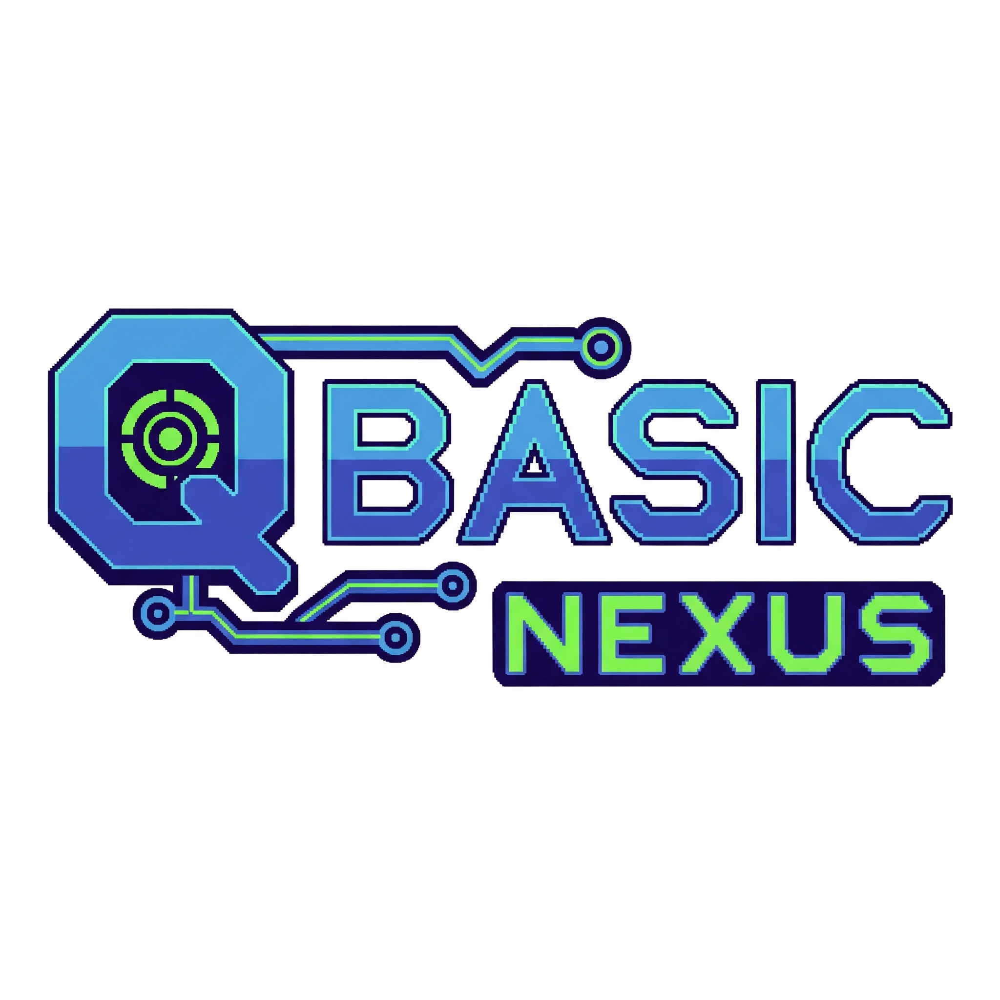

<div align="center">
  
</div>
<div align="center">
  <h1>QBasic Nexus ⚙️</h1>
  <p>
    <strong>The Ultimate Modern QBasic & QB64 Development Environment for VS Code</strong>
  </p>
  <p>
    <a href="#-features">Features</a> •
    <a href="#-quick-start-guide">Quick Start</a> •
    <a href="#-web-runtime-capabilities">Web Runtime</a> •
    <a href="#-configuration">Configuration</a> •
    <a href="#-troubleshooting">Troubleshooting</a>
  </p>
</div>

<br>

**QBasic Nexus** transforms VS Code into a powerful retro-coding station. Whether you're a veteran developer reliving the glory days or a new learner exploring the roots of programming, QBasic Nexus provides a seamless, modern experience for **QBasic** and **QB64**.

It offers **dual-mode execution**: compile native executables using your existing QB64 installation, OR run your code instantly in a **browser-based retro CRT** with zero setup—complete with graphics, sound, and mouse support!

---

## 📖 Table of Contents

- [✨ Features](#-features)
  - [🔧 Dual Compilation Modes](#-dual-compilation-modes)
  - [📺 Advanced Web Runtime](#-advanced-web-runtime)
  - [📊 Professional IDE Tools](#-professional-ide-tools)
- [🚀 Quick Start Guide](#-quick-start-guide)
- [🎬 Web Runtime Capabilities](#-web-runtime-capabilities)
  - [Supported Keywords](#supported-keywords)
  - [Graphics & Sound](#graphics--sound)
  - [Mouse & Input](#mouse--input)
- [📦 Available Commands](#-available-commands)
- [🛠️ Configuration](#️-configuration)
- [🧩 Snippets Reference](#-snippets-reference)
- [🆘 Troubleshooting](#-troubleshooting)
- [📄 License](#-license)

---

## ✨ Features

### 🔧 Dual Compilation Modes

| Mode | Description | Best For |
|------|-------------|----------|
| **QB64 Native (Recommended)** | Uses your local QB64 compiler to build optimized standalone `.exe` binaries. | Performance-critical apps, full system access, deployment. |
| **Internal Web Transpiler** | Instantly transpiles QBasic to JavaScript and runs it in a simulated CRT webview. **No compiler installation required!** | Quick prototyping, learning, testing logic, playing with retro graphics/sound. |

### 📺 Advanced Web Runtime

The internal web runtime is not just a toy—it's a fully-featured emulation layer powered by HTML5 Canvas and Web Audio API.

*   **Retro CRT Quality**: Authentic scanlines, text lag, and phosphor persistence effects.
*   **Rich Graphics**: Supports `SCREEN`, `PSET`, `LINE`, `CIRCLE`, `PAINT`, `GET`, `PUT`, and more.
*   **High-Fidelity Audio**: Full `PLAY` command parsing (octaves, tempo, legato/staccato), `SOUND`, and `BEEP`.
*   **QB64 Extensions**: Supports advanced keywords like `_RGB32`, `_MOUSEINPUT`, `_LIMIT`, `_DELAY`, and `_PI`.
*   **Virtual File System**: Uses LocalStorage to simulate file I/O (`OPEN`, `WRITE`, `INPUT#`) so your data persists between runs!

### 📊 Professional IDE Tools

*   **IntelliSense**: Smart auto-completion for over 400+ keywords, including QB64 specifics.
*   **Real-time Linting**: Catches syntax errors (missing `NEXT`, invalid types) as you type.
*   **Code Navigation**: "Go to Definition" (F12) for Subs, Functions, and Types.
*   **Formatting**: Auto-indentation and casing (e.g., converts `print` to `PRINT`) with `Shift+Alt+F`.
*   **Outline View**: Navigate large files instantly via the VS Code Outline panel.

---

---
 
 ## 🎮 Interactive Tutorials
 
 New to QBasic? The **Interactive Tutorial Mode** solves the "blank screen" problem.
 
 1.  Open the Command Palette (`Ctrl+Shift+P`).
 2.  Select **"QBasic: Start Interactive Tutorial 🎮"**.
 3.  Choose a lesson (e.g., "Hello World", "Variables", "Loops").
 4.  Read the **Mission Objective** and write code to solve it.
 5.  Run your code (`F5`). If the output matches the goal, you get a **"Mission Complete"** badge and unlock the next level!
 
 ---
 
 ## 🚀 Quick Start Guide

### 1. Installation
Install **QBasic Nexus** from the VS Code Marketplace.

### 2. Choose Your Mode

#### Option A: Zero-Setup (Web Runtime)
You don't need to install anything else!
1.  Create a file named `hello.bas`.
2.  Type:
    ```basic
    SCREEN 13
    COLOR 14
    PRINT "Hello from QBasic Nexus!"
    CIRCLE (160, 100), 50, 4
    PLAY "CDEFGAB>C"
    ```
3.  Press **F5**. Select **"Internal (JS Transpiler)"** if prompted, or set it as default in settings.

#### Option B: Native Mode (QB64)
For producing real `.exe` files:
1.  Download [QB64 Phoenix Edition](https://qb64phoenix.com/) or classic QB64.
2.  **(macOS/Linux)** Run the `./setup_osx.command` or `./setup_lnx.sh` script in the QB64 folder.
3.  In VS Code, open Settings (`Ctrl+,`) and search for `QBasic Nexus Compiler Path`.
4.  Enter the full path to your `qb64` executable.

---

## 🎬 Web Runtime Capabilities

The internal transpiler is highly capable. Below is a breakdown of what it supports.

### Supported Keywords

| Category | Commands Supported |
|----------|--------------------|
| **Core I/O** | `PRINT`, `INPUT`, `CLS`, `LOCATE`, `COLOR`, `SCREEN`, `WIDTH`, `LPRINT`, `WRITE` |
| **Logic** | `IF`, `THEN`, `ELSE`, `ELSEIF`, `Select Case`, `FOR...NEXT`, `DO...LOOP`, `WHILE...WEND` |
| **Math** | `ABS`, `INT`, `FIX`, `SIN`, `COS`, `TAN`, `ATN`, `SQR`, `LOG`, `EXP`, `RND`, `SGN` |
| **Adv. Math** | `_PI`, `_ROUND`, `_CEIL`, `_HYPOT`, `_ATAN2`, `_SINH`, `_COSH`, `_TANH`, `_D2R`, `_R2D` |
| **Strings** | `LEFT$`, `RIGHT$`, `MID$`, `LEN`, `UCASE$`, `LCASE$`, `LTRIM$`, `RTRIM$`, `INSTR`, `CHR$`, `ASC`, `STR$`, `VAL` |
| **System** | `TIMER`, `DATE$`, `TIME$`, `SLEEP`, `INKEY$`, `CSRLIN`, `POS`, `SHELL`, `CHAIN`, `RUN` |
| **File System** | `OPEN`, `CLOSE`, `NAME`, `KILL`, `MKDIR`, `RMDIR`, `CHDIR`, `FILES`, `SEEK`, `LOCK`, `UNLOCK` |
| **Graphics** | `LINE`, `CIRCLE`, `PSET`, `PRESET`, `DRAW`, `PAINT`, `VIEW`, `WINDOW`, `GET`, `PUT`, `PALETTE`, `PCOPY` |
| **QB64** | `_LIMIT`, `_DELAY`, `_PI`, `_RGB32`, `_RGBA32`, `_TITLE`, `_FULLSCREEN`, `_SCREENMOVE`, `_DEST`, `_SOURCE`, `_FONT`, `_CLIPBOARD` |
| **Adv. Audio** | `_SNDPLAY`, `_SNDSTOP`, `_SNDVOL`, `_SNDPAUSE`, `_SNDLOOP`, `_SNDBAL`, `_SNDSETPOS`, `_SNDCLOSE` |
| **Memory** | `POKE`, `_MEMFREE`, `_MEMCOPY`, `_MEMFILL`, `_PUTIMAGE`, `_PRINTSTRING`, `_freeImage` |

### Graphics & Sound
*   **Graphics**: Full primitives (`LINE`, `box`, `CIRCLE`, `PSET`) and image manipulation (`GET`, `PUT`). Transparent coloring supported via `_RGB32`.
*   **Sound**: The `PLAY` command is fully implemented with macro language support (e.g., `PLAY "T160 O3 L8 C D E F"`). `SOUND` and `BEEP` work seamlessly without blocking the UI thread (unless desired).

### Mouse & Input
We support the modern QB64 mouse API within the browser:
```basic
DO
    _LIMIT 60
    x = _MOUSEX
    y = _MOUSEY
    buttons = _MOUSEBUTTON
    
    IF _MOUSEBUTTON(1) THEN CIRCLE (x, y), 5, 14
LOOP UNTIL INKEY$ = CHR$(27)
```

---

## 📦 Available Commands

| Command | Title (in Palette) | Shortcut | Description |
|---------|--------------------|----------|-------------|
| `qbasic-nexus.compileAndRun` | **Compile & Run 🌀** | `F5` | Runs code (Native or Web based on settings). |
| `qbasic-nexus.compile` | **Compile Only 🔨** | `Ctrl+Shift+B` | Builds an executable (Native mode only). |
| `qbasic-nexus.runInCrt` | **Run in Retro CRT 📺** | - | Force-run in the Web Runtime regardless of settings. |
| `qbasic-nexus.startTutorial` | **Start Interactive Tutorial 🎮** | - | Launch an interactive QBasic tutorial for beginners. |
| `qbasic-nexus.showCodeStats` | **Show Code Statistics 📊** | `Ctrl+Shift+I` | Count LOC, Subs, and Functions. |
| `qbasic-nexus.toggleComment` | **Toggle Comment 💬** | `Ctrl+/` | Comment or uncomment selected lines. |
| `qbasic-nexus.extractToSub` | **Extract to SUB 📦** | - | Refactor selected lines into a new Sub. |

---

## 🛠️ Configuration

| Setting | Default | Description |
|---------|---------|-------------|
| `qbasic-nexus.compilerMode` | `QB64` | Switch between **QB64 (Recommended)** and **Internal (JS Transpiler)**. |
| `qbasic-nexus.compilerPath` | `null` | Path to your local QB64 executable for Native mode. |
| `qbasic-nexus.enableLinting` | `true` | Show syntax errors in real-time. |
| `qbasic-nexus.lintDelay` | `500` | Milliseconds to wait after typing before linting. |
| `qbasic-nexus.autoFormatOnSave` | `false` | Automatically format code (indentation, casing) when saving. |
| `qbasic-nexus.compilerArgs` | `""` | Additional flags for the QB64 compiler (e.g., `-w`). |

---

## 🧩 Snippets Reference

Type these prefixes and press `Tab` to generate code instantly:

*   **Structure**: `sub`, `function`, `type`, `select`, `if`, `ifelse`
*   **Loops**: `for`, `forstep`, `dowhile`, `dountil`
*   **Graphics**: `screen`, `line`, `circle`, `rgb`
*   **Input**: `input`, `inkey`, `mousecheck`, `keycheck`
*   **Templates**: 
    *   `newqb64` -> Standard setup with `_TITLE` and `SCREEN`.
    *   `gameloop` -> A ready-to-run game loop structure with `_LIMIT`.

---

## 🆘 Troubleshooting

### Web Runtime (CRT) Issues
*   **No Sound?** Browsers block audio until you interact with the page. Click anywhere inside the CRT window to enable audio engine.
*   **Slow?** Ensure you are using `_LIMIT 60` inside loops. Without it, the loop runs as fast as possible, which might freeze the browser tab.

### Native Compiler Issues
*   **"Compiler not found"**: Double-check `qbasic-nexus.compilerPath`. It must point to the *executable* file (e.g., `qb64.exe`), not just the folder.
*   **macOS Security**: You may need to go to System Settings > Privacy & Security to allow `qb64` to run the first time.
*   **Linux Dependencies**: Ensure you have C++ compilers installed (`sudo apt install build-essential`).
 
 ### Known Limitations (Web Runtime)
 *   **Direct Memory Access**: Commands like `PEEK`, `POKE`, `VARPTR` are emulated safely (stubs) and may not return real memory addresses.
 *   **Binary I/O**: `INPUT$` and raw binary file modes are currently limited in the web environment. Use `OPEN` for text processing.

---

## 📄 License

MIT License © 2025-2026 Thirawat Sinlapasomsak

<div align="center">
  <p>Made with ❤️ by <a href="https://github.com/thirawat27">Thirawat27</a></p>
  <p>
    <a href="https://github.com/thirawat27/QBasic-Nexus">GitHub</a> •
    <a href="https://github.com/thirawat27/QBasic-Nexus/issues">Report Bug</a>
  </p>
</div>