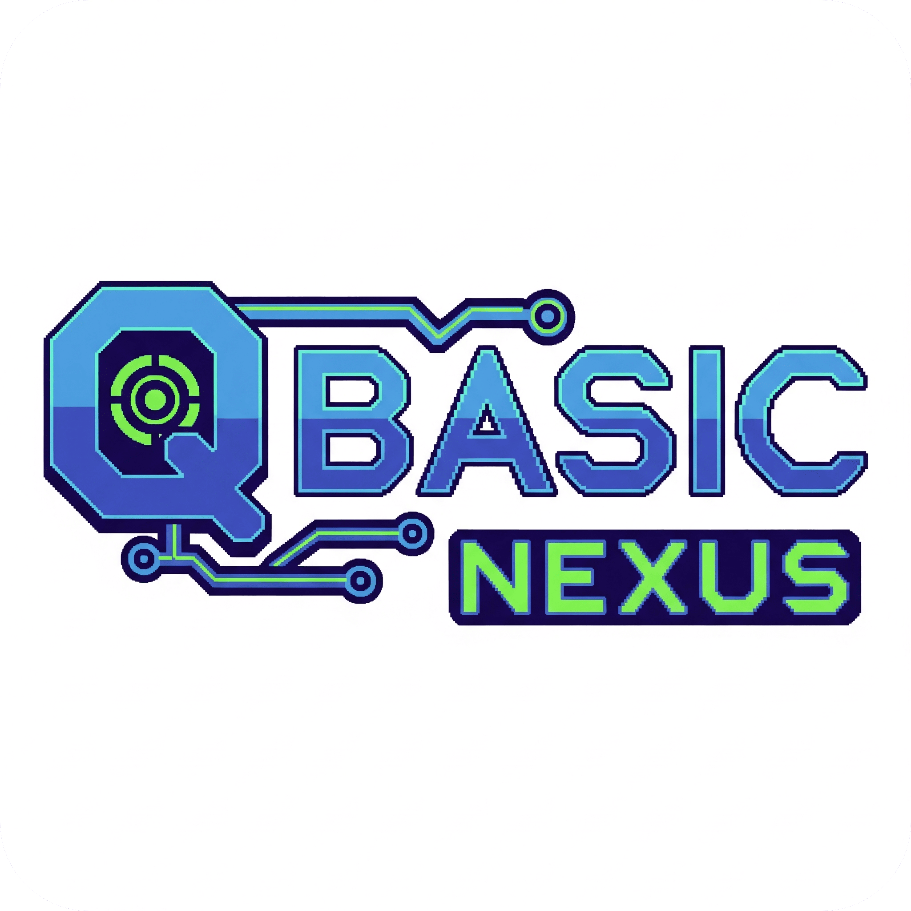

<div align="center">
  
</div>
<div align="center">
  <h1>QBasic Nexus ⚙️</h1>
  <p>
    <strong>The Most Advanced, Lightning-Fast QBasic & QB64 Development Environment Ever Built for VS Code 🚀</strong><br>
    <em>Experience zero-setup compilation, state-of-the-art IntelliSense, and a stunning built-in Retro CRT Web Runtime that leaves all others in the dust.</em>
  </p>
  <p>
    <a href="#️-prerequisites">Prerequisites</a> •
    <a href="#-getting-started">Getting Started</a> •
    <a href="#️-configuration-guide">Configuration</a> •
    <a href="#-unrivaled-features">Features</a> •
    <a href="#-troubleshooting">Troubleshooting</a>
  </p>
  <p>
     
    
    
    
  </p>
</div>

<br>

**QBasic Nexus** transforms VS Code into an immensely powerful retro-coding station. Engineered from the ground up for raw performance, it features a blazingly fast custom transpiler, multi-tiered caching, and out-of-the-box native executable packaging for Windows, macOS, and Linux. Whether you're a veteran developer reviving classic code or a newcomer learning the roots of programming, QBasic Nexus provides an unmatched, modern experience for **QBasic** and **QB64**.

---

## 📖 Table of Contents

- [⚙️ Prerequisites](#️-prerequisites)
- [🚀 Getting Started](#-getting-started)
  - [Step 1 - Install QB64](#step-1---install-qb64-optional-but-recommended)
  - [Step 2 - Install Extension](#step-2---install-qbasic-nexus-extension)
  - [Step 3 - Configure Path](#step-3---configure-compiler-path)
  - [Step 4 - Start Coding](#step-4---start-coding)
- [🛠️ Configuration Guide](#️-configuration-guide)
  - [Compiler Settings](#compiler-settings)
  - [Editor Settings](#editor-settings)
  - [Line Number Settings](#line-number-settings)
- [📂 Supported File Types & Icons](#-supported-file-types--icons)
- [✨ Features](#-unrivaled-features)
  - [Lightning-Fast Compilation](#-lightning-fast-compilation-engine)
  - [Advanced Web Runtime](#-advanced-web-runtime)
  - [Professional IDE Tools](#-professional-ide-tools)
  - [Advanced Code Tools](#-advanced-code-tools)
- [📦 Available Commands](#-available-commands)
- [🎬 Web Runtime Capabilities](#-web-runtime-capabilities)
- [🧩 Snippets Reference](#-snippets-reference)
- [🎮 Interactive Tutorial](#-the-interactive-curriculum)
- [🔥 QBNex Compiler](#-introducing-qbnex-compiler)
- [🆘 Troubleshooting](#-troubleshooting)
- [🤝 Contributing](#-contributing)
- [📄 License](#-license)

---

## ⚙️ Prerequisites

QBasic Nexus offers two compilation modes, each with different requirements.

### Mode 1 - QBasic Nexus Internal (Fully Standalone)

**No prerequisites whatsoever!**

The internal transpiler works out of the box with zero setup. You can write QBasic code and immediately

- Run it in the beautiful Retro CRT viewer inside VS Code
- Compile it into one or more standalone Node.js-based native executables for the host or configured pkg targets
- Test and debug without any external dependencies

This mode is perfect for learning, prototyping, and quick testing.

**How QBasic Nexus Internal Works**

The internal compiler transpiles your QBasic code to JavaScript, then packages it with the Node.js runtime using `@yao-pkg/pkg` to create one or more standalone executables for the selected targets.

**Key Characteristics**

- **File Size** - Executables are typically 40-50MB (includes Node.js runtime)
- **Performance** - Slightly slower than native QB64 compilation, but excellent for most use cases
- **Compatibility** - Supports 575+ QBasic, QuickBASIC 4.5, and QB64 keywords and functions
- **Platform** - Generates native executables for `host` or explicit `pkg` targets such as `win-x64`, `linux-x64`, and `macos-arm64`

**Limitations Compared to QB64**

- No direct physical hardware access (serial ports, parallel ports, USB)
- Memory access (`PEEK`, `POKE`, `OUT`, `INP`) is sandboxed to the internal runtime memory space
- No inline assembly (ASM blocks)
- Virtual File System is limited to 10MB per workspace
- Certain advanced QB64-specific libraries (like OpenGL or networking) may not be available
- Graphics limited to SCREEN 13 (320x200, 256 colors) / limited Point tracking internally
- External program execution via `RUN` / `CHAIN` without internal targets will fail explicitly

**Best Use Cases**

- Learning QBasic programming
- Quick prototyping and testing
- Creating simple games and utilities
- Cross-platform development without QB64 installation
- Demonstrations and educational purposes

### Mode 2 - QB64 (Recommended for Production)

**Requires QB64 Installation**

For full legacy compatibility and native executable compilation, you'll need QB64 installed on your system.

**Download QB64**

- Legacy Edition (Recommended) - [qb64.com](https://qb64.com/)
- Phoenix Edition (Alternative) - [qb64phoenix.com](https://www.qb64phoenix.com/)

**Platform-Specific Requirements**

**Windows**

- Simply download and extract QB64 to any folder
- No additional setup required

**macOS**

- Install Xcode Command Line Tools first - `xcode-select --install`
- After extracting QB64, you MUST run the setup script (see Getting Started below)

**Linux**

- Install build tools - `sudo apt-get install build-essential`
- After extracting QB64, you MUST run the setup script (see Getting Started below)

---

## 🚀 Getting Started

Follow these steps to get QBasic Nexus up and running.

### Step 1 - Install QB64 (Optional but Recommended)

**Why install QB64?**

- Compile to true native executables with full system access
- 100% compatibility with legacy QBasic/QuickBASIC code
- Better performance for complex programs
- Access to QB64-specific extensions and libraries

**Installation Process**

**1.1 Download QB64**

Visit [qb64.com](https://qb64.com/) or [qb64phoenix.com](https://www.qb64phoenix.com/) and download the appropriate version for your operating system.

**1.2 Extract QB64**

Extract the downloaded archive to a permanent location on your system. Choose a path without spaces for best compatibility.

**Recommended locations**

- Windows - `C:\QB64\` or `C:\Program Files\QB64\`
- macOS - `/Applications/QB64/` or `~/QB64/`
- Linux - `~/qb64/` or `/opt/qb64/`

**1.3 Run Setup Script (macOS and Linux ONLY)**

This step is **absolutely critical** for macOS and Linux users. The setup script configures the compiler and builds necessary components.

**What the Setup Script Does**

- Compiles the QB64 compiler itself from C++ source code
- Builds platform-specific libraries and dependencies
- Configures paths and environment variables
- Creates necessary helper executables
- Sets up the internal C++ compiler integration

**Expected Duration**

- macOS - 3-5 minutes (depending on Mac model)
- Linux - 2-4 minutes (depending on CPU speed)
- First-time setup downloads and compiles multiple components

**On macOS**

1. Open Terminal (Applications > Utilities > Terminal)
2. Navigate to your QB64 directory
   ```bash
   cd /Applications/QB64
   ```
3. Run the setup script
   ```bash
   sh ./setup_osx.command
   ```
4. Wait for the setup to complete

**Success Indicators (macOS)**
You'll see output similar to

```
Compiling QB64...
Building internal libraries...
Setup complete!
```

**On Linux**

1. Open Terminal
2. Navigate to your QB64 directory
   ```bash
   cd ~/qb64
   ```
3. Run the setup script
   ```bash
   sh ./setup_lnx.sh
   ```
4. Wait for the setup to complete

**Success Indicators (Linux)**
You'll see output similar to

```
Bootstrapping QB64...
Compiling...
Done!
```

**Common Setup Errors and Solutions**

**Error - "Permission denied"**

- Solution - Run `chmod +x setup_osx.command` (macOS) or `chmod +x setup_lnx.sh` (Linux) first

**Error - "Command not found: gcc" or "Command not found: g++"**

- macOS - Install Xcode Command Line Tools - `xcode-select --install`
- Linux - Install build-essential - `sudo apt-get install build-essential`

**Error - "Cannot find X11 libraries" (Linux)**

- Solution - Install X11 development files - `sudo apt-get install libx11-dev libxrandr-dev`

**Error - Setup hangs or freezes**

- Solution - Press Ctrl+C, delete the QB64 folder, re-extract, and try again

**Important Notes**

- Without running the setup script, QB64 will NOT work
- You only need to run the setup script once after installation
- If you move QB64 to a different location, run the setup script again
- The setup script must complete successfully (check for "Done" or "Complete" message)
- If setup fails, check the error messages carefully and install missing dependencies

### Step 2 - Install QBasic Nexus Extension

**2.1 Open VS Code Extensions**

- Click the Extensions icon in the sidebar (or press `Ctrl+Shift+X` / `Cmd+Shift+X`)

**2.2 Search and Install**

- Search for "QBasic Nexus"
- Click the "Install" button
- Wait for installation to complete

**2.3 Reload VS Code (if prompted)**

- Click "Reload" if VS Code asks you to restart

### Step 3 - Configure Compiler Path

**Understanding Auto-Detection**

When you first open a QBasic file (`.bas`, `.bi`, `.bm`, or `.inc`), QBasic Nexus will automatically try to find your QB64 installation by searching common locations.

**How Auto-Detection Works**

The extension checks several sources in order:

1. Environment hints such as `QB64_HOME`, `QB64_PATH`, `QB64PE_HOME`, and `QB64PE_PATH`
2. Common install folders on Windows, macOS, and Linux (including QB64 Phoenix Edition layouts)
3. Your `PATH`

**Detection Process**

- Checks each path in order until a valid QB64 executable is found
- Verifies the file exists, is executable, and looks like a real QB64/QB64PE binary
- Stops at the first valid installation found

**If Multiple QB64 Installations Exist**

- Auto-detection will use the first one found in the search order
- You can manually override by setting the path in settings
- The extension remembers your choice for future sessions

**3.1 If Auto-Detection Succeeds**

You'll see a notification popup asking

```
"Found QB64 at [path]. Save this path for future builds?"
```

- Click **"Save Path"** - The path will be saved automatically
- Click **"Continue Once"** - Compilation uses the detected path for the current session
- Click **"Not Now"** - You can set the path manually later (see below)

**3.2 If Auto-Detection Fails (Manual Configuration)**

If QB64 isn't found automatically, or you want to use a different installation, follow these steps

**Method A - Via Status Bar (Easiest)**

1. Open any QBasic file (`.bas`)
2. Look at the bottom Status Bar
3. You'll see **QB64 Auto-Detect** when no saved path exists yet
4. Click on it
5. VS Code Settings will open automatically to the correct setting

**Method B - Via Settings Menu**

1. Open VS Code Settings
   - Windows/Linux - Press `Ctrl+,`
   - macOS - Press `Cmd+,`
2. In the search box at the top, type **"QBasic Nexus Compiler Path"**
3. Find the setting **"Qbasic-nexus Compiler Path"**
4. Click "Edit in settings.json" or enter the path directly

**3.3 Enter the Correct Path**

You need to provide the **full, absolute path** to the QB64 executable file (not just the folder).

**Path Examples by Operating System**

**Windows**

```
C:\QB64\qb64.exe
```

or

```
C:\Program Files\QB64\qb64.exe
```

**macOS**

```
/Applications/QB64/qb64
```

or

```
/Users/yourname/QB64/qb64
```

**Linux**

```
/home/yourname/qb64/qb64
```

or

```
/opt/qb64/qb64
```

**Important Path Rules**

- Must be the full path to the executable file itself
- Must include the filename (`qb64.exe` on Windows, `qb64` on macOS/Linux)
- Use forward slashes `/` or double backslashes `\\` on Windows
- Avoid paths with spaces if possible

**3.4 Verify Configuration**

After setting the path

1. Open or create a `.bas` file
2. Check the Status Bar at the bottom
3. You should see a compile icon (🔨) instead of the warning
4. The extension is now ready to use!

**3.5 Switching Between Compiler Modes**

You can switch between QB64 and the internal QBasic Nexus compiler anytime

1. Open Settings (`Ctrl+,` or `Cmd+,`)
2. Search for **"QBasic Nexus Compiler Mode"**
3. Choose your preferred mode
   - **"QB64 (Recommended)"** - Uses external QB64 for native compilation
   - **"Qbasic Nexus"** - Uses internal transpiler for quick testing

**What Happens When You Switch Modes?**

**Switching from QB64 to QBasic Nexus**

- Previously compiled QB64 executables remain unchanged
- Next compilation will use the internal transpiler
- No need to re-compile existing working programs
- Settings like `compilerPath` are ignored in QBasic Nexus mode

**Switching from QBasic Nexus to QB64**

- Previously compiled QBasic Nexus executables remain unchanged
- Next compilation will use QB64 (if path is configured)
- You may need to set the `compilerPath` if not already configured
- Some code may need adjustments for QB64 compatibility

**Important Notes**

- Mode switching is instant and doesn't affect existing files
- Each mode creates separate executable files
- You can keep both versions of compiled programs
- The Status Bar icon updates to reflect the current mode
- F5 always uses the currently selected mode

### Step 4 - Start Coding

**4.1 Create Your First QBasic File**

1. Create a new file - `hello.bas`
2. Write some QBasic code
   ```basic
   SCREEN 13
   COLOR 14
   PRINT "Welcome to the Nexus!"
   CIRCLE (160, 100), 50, 4
   PLAY "T120 O4 L4 C D E F G A B >C"
   ```

**4.2 Run Your Code**

You have multiple options to run your code

**Option 1 - Press F5 (Recommended)**

- Simply press `F5` on your keyboard
- Your code will compile and run using the selected compiler mode

**Option 2 - Use the Status Bar**

- Click the compile icon (🔨) in the bottom Status Bar
- Quick and convenient for mouse users

**Option 3 - Use Command Palette**

- Press `Ctrl+Shift+P` (Windows/Linux) or `Cmd+Shift+P` (macOS)
- Type "QBasic Compile & Run"
- Press Enter

**Option 4 - Run in Retro CRT Viewer**

- Press `Ctrl+Shift+P` / `Cmd+Shift+P`
- Type "QBasic Run in Retro CRT"
- See your code running in a beautiful retro terminal inside VS Code!

**4.3 Understanding the Output**

Each compilation mode produces different results. Here's a detailed comparison to help you choose the right mode for your needs.

**Comparison Table**

| Feature                 | QB64 Mode                | QBasic Nexus Mode                 | Retro CRT Viewer       |
| ----------------------- | ------------------------ | --------------------------------- | ---------------------- |
| **Output Type**         | Native executable        | Node.js-based native executable   | In-browser runtime     |
| **File Size**           | 2-5 MB                   | 40-50 MB                          | No file created        |
| **Startup Speed**       | Instant                  | ~1 second                         | Instant                |
| **Runtime Performance** | Fastest (native)         | Fast (V8 engine)                  | Good (browser)         |
| **System Access**       | Full (files, hardware)   | Sandboxed (Virtual FS, Memory)    | Sandboxed (Virtual FS) |
| **Graphics**            | All SCREEN modes         | Text & SCREEN 13                  | SCREEN 13 only         |
| **Audio**               | Full QB64 audio          | PLAY & SOUND                      | PLAY & SOUND           |
| **Distribution**        | Single native executable | Cross-platform standalone targets | Requires VS Code       |
| **Cross-Platform**      | Platform-specific        | Windows/macOS/Linux/Alpine        | Any platform           |
| **Setup Required**      | QB64 installation        | None                              | None                   |
| **Best For**            | Production apps          | Quick testing & isolated apps     | Demos & learning       |

**When using QB64 mode**

- A native executable will be created in the same folder as your `.bas` file
- The program will run in a separate window
- Output files - `yourfile.exe` (Windows) or `yourfile` (macOS/Linux)
- Full access to system resources (files, network, hardware)
- Supports all QB64 features and libraries
- Smallest file size and fastest performance
- Platform-specific - compile on Windows for Windows, macOS for macOS, etc.

**When using QBasic Nexus mode**

- Code is transpiled to JavaScript
- Packaged as a standalone native executable using Node.js and `@yao-pkg/pkg`
- Larger file size (~40-50MB) but includes entire runtime
- Slightly slower startup but good runtime performance
- Virtual file system limited to 10MB
- No external dependencies needed
- Perfect for quick prototyping and testing
- Output files are `yourfile.exe` on Windows or `yourfile` on macOS/Linux

**When using Retro CRT viewer**

- Code runs inside VS Code in a webview panel
- Beautiful retro aesthetic with scanlines and CRT effects
- No executable file is created
- Perfect for testing and demonstrations
- Instant feedback - no compilation wait time
- Limited to SCREEN 13 graphics mode
- Virtual file system persists in browser storage
- Great for learning and experimenting

**Performance Comparison**

**Compilation Time**

- QB64 - 2-10 seconds (depends on code size)
- QBasic Nexus - 5-15 seconds (includes packaging)
- CRT Viewer - <1 second (transpile only)

**Runtime Speed (relative)**

- QB64 - 100% (baseline, native code)
- QBasic Nexus - 70-90% (V8 JavaScript engine)
- CRT Viewer - 60-80% (browser with rendering overhead)

**Use Case Recommendations**

**Choose QB64 Mode when**

- Building production applications
- Need maximum performance
- Require full system access
- Using advanced QB64 libraries
- Distributing to end users
- Need smallest file size

**Choose QBasic Nexus Mode when**

- Learning QBasic programming
- Quick prototyping and testing
- QB64 is not installed
- Don't need hardware access
- Want zero-setup compilation
- File size is not critical

**Choose CRT Viewer when**

- Testing code snippets quickly
- Demonstrating code to others
- Learning with instant feedback
- Don't need to create executables
- Want the nostalgic CRT aesthetic
- Teaching or presenting

---

## 🛠️ Configuration Guide

Fine-tune QBasic Nexus to match your workflow. Access settings via `File > Preferences > Settings` and search for **"QBasic Nexus"**.

### Compiler Settings

These settings control how your QBasic code is compiled and executed.

**Compiler Mode**

- **Setting Name** - `qbasic-nexus.compilerMode`
- **Type** - Dropdown selection
- **Default** - `QB64 (Recommended)`
- **Options**
  - `QB64 (Recommended)` - Compile with external QB64 for native executables with full system access and best performance
  - `Qbasic Nexus` - Use the internal transpiler to convert QBasic to JavaScript, then package one or more standalone executables for the selected internal targets

**When to use QB64 mode**

- Production applications requiring native performance
- Programs that need direct system access (file I/O, hardware)
- Legacy code that must run exactly like original QBasic/QuickBASIC
- Maximum compatibility with existing QB64 code

**When to use QBasic Nexus mode**

- Quick prototyping and testing
- Learning and experimentation
- When QB64 is not installed
- Cross-platform development without external dependencies

---

**Compiler Path**

- **Setting Name** - `qbasic-nexus.compilerPath`
- **Type** - String (file path)
- **Default** - `null` (not set)
- **Required For** - QB64 mode only

**What to enter**

- The full, absolute path to your QB64 executable
- Must point to the executable file itself, not just the folder

**Examples**

```
Windows  C:\QB64\qb64.exe
macOS    /Applications/QB64/qb64
Linux    /home/yourname/qb64/qb64
```

**How to find your QB64 path**

1. Locate where you extracted QB64
2. Find the executable file (qb64.exe on Windows, qb64 on macOS/Linux)
3. Copy the full path including the filename
4. Paste into this setting

**Troubleshooting**

- If you see "Compiler not found" errors, double-check this path
- Make sure the file exists and is executable
- On macOS/Linux, ensure you ran the setup script first

---

**Compiler Args**

- **Setting Name** - `qbasic-nexus.compilerArgs`
- **Type** - String
- **Default** - `""` (empty)
- **Required For** - QB64 mode only

**What this does**

- Passes additional command-line arguments to QB64 when compiling
- Useful for advanced users who need specific compiler flags

**Common arguments**

- `-w` - Show compiler warnings
- `-g` - Include debug information
- `-e` - Treat warnings as errors
- `-x` - Compile without running

**Example**

```
-w -g
```

**Note** - Most users can leave this empty. Only modify if you know what specific QB64 flags you need.

---

**Internal Targets**

- **Setting Name** - `qbasic-nexus.internalTargets`
- **Type** - String
- **Default** - `"host"`
- **Required For** - QBasic Nexus internal mode

**What this does**

- Selects which `@yao-pkg/pkg` target or targets the internal compiler should build
- Accepts `host` or comma-separated targets such as `win-x64`, `linux-x64`, `macos-arm64`, or `host,linux-x64`
- `Compile & Run` only auto-runs when the result is a single host-compatible target

**Examples**

```
host
linux-x64
host,linux-x64
```

---

**Internal Output Directory**

- **Setting Name** - `qbasic-nexus.internalOutputDir`
- **Type** - String
- **Default** - `""` (writes beside the source file)
- **Required For** - QBasic Nexus internal mode

**What this does**

- Sends all internally packaged binaries to a dedicated folder
- Relative paths resolve from the workspace folder when one exists
- Absolute paths are also accepted

**Examples**

```
dist
build/artifacts
C:\QBasicNexus\out
```

### Editor Settings

These settings control the editing experience and real-time code analysis.

**Enable Linting**

- **Setting Name** - `qbasic-nexus.enableLinting`
- **Type** - Boolean (checkbox)
- **Default** - `true` (enabled)

**What this does**

- Enables real-time syntax checking as you type
- Highlights errors with red squiggly underlines
- Shows error messages when you hover over problems
- Displays error count in the Problems panel

**Benefits of enabling**

- Catch syntax errors immediately before running code
- See exactly where and what the problem is
- Faster development with instant feedback
- Learn proper QBasic syntax through helpful error messages

**When to disable**

- Working with very large files (>10,000 lines) that cause slowdown
- Intentionally writing incomplete code snippets
- Experiencing performance issues on slower machines

---

**Lint Delay**

- **Setting Name** - `qbasic-nexus.lintDelay`
- **Type** - Number (milliseconds)
- **Default** - `500` (half a second)
- **Range** - 100 to 3000 ms

**What this does**

- Controls how long the extension waits after you stop typing before checking your code
- Prevents constant re-checking while you're actively typing
- Balances responsiveness with performance

**Choosing the right value**

- **Lower values (100-300ms)** - Faster feedback, but uses more CPU
  - Good for Fast computers, small files, users who want instant feedback
- **Medium values (400-600ms)** - Balanced approach (recommended)
  - Good for Most users and typical file sizes
- **Higher values (700-3000ms)** - Less frequent checking, saves CPU
  - Good for Slower computers, large files, battery-powered devices

**Example scenarios**

```
Fast desktop, small files     300ms
Typical laptop, normal files  500ms
Older computer, large files   1000ms
```

---

**Auto Format On Save**

- **Setting Name** - `qbasic-nexus.autoFormatOnSave`
- **Type** - Boolean (checkbox)
- **Default** - `true` (enabled)

**What this does**

- Automatically formats your code when you save the file (`Ctrl+S` / `Cmd+S`)
- Mimics the classic QBasic IDE behavior

**Formatting actions performed**

- **Keyword capitalization** - Converts keywords to proper case
  - `print` → `PRINT`
  - `if...then` → `IF...THEN`
  - `sub` → `SUB`
- **Consistent indentation** - Standardizes spacing and indentation
- **Whitespace cleanup** - Removes trailing spaces

**Benefits**

- Code looks professional and consistent
- Easier to read and maintain
- Matches the nostalgic QBasic IDE experience
- No need to manually capitalize keywords

**When to disable**

- You prefer lowercase keywords
- Working with auto-generated code that shouldn't be modified
- Collaborating on code with specific style requirements

### Line Number Settings

These settings control the line numbering tools for legacy QBasic code.

**Line Number Start**

- **Setting Name** - `qbasic-nexus.lineNumberStart`
- **Type** - Number
- **Default** - `1`
- **Minimum** - `1`

**What this does**

- Sets the starting line number when using the "Renumber Lines" command
- Useful when converting old QBasic code that used line numbers

**Example**

- If set to `10`, renumbering will start at line 10, then 20, 30, etc. (depending on step)
- If set to `100`, renumbering will start at line 100, then 200, 300, etc.

**Common values**

- `1` - Modern style, sequential numbering
- `10` - Classic QBasic style with room for insertions
- `100` - Old BASIC style with large gaps

---

**Line Number Step**

- **Setting Name** - `qbasic-nexus.lineNumberStep`
- **Type** - Number
- **Default** - `1`
- **Minimum** - `1`

**What this does**

- Sets the increment between line numbers when using "Renumber Lines"
- Determines the spacing between consecutive line numbers

**Example**

- Step of `1` - Lines numbered 1, 2, 3, 4, 5...
- Step of `10` - Lines numbered 10, 20, 30, 40, 50...
- Step of `100` - Lines numbered 100, 200, 300, 400, 500...

**Why use larger steps?**

- Leaves room to insert new lines between existing ones
- Traditional BASIC programming practice
- Easier to reference specific sections (e.g., "the 1000s section")

**Recommended combinations**

```
Modern style          Start 1,    Step 1
Classic QBasic        Start 10,   Step 10
Old-school BASIC      Start 100,  Step 100
Structured sections   Start 1000, Step 1000
```

---

**Quick Settings Access**

**Via Command Palette**

1. Press `Ctrl+Shift+P` / `Cmd+Shift+P`
2. Type "Preferences Open Settings"
3. Search for "QBasic Nexus"

**Via Settings UI**

1. Click File > Preferences > Settings (or Code > Preferences > Settings on macOS)
2. Search for "QBasic Nexus" in the search box
3. All QBasic Nexus settings will appear

**Via settings.json (Advanced)**

1. Press `Ctrl+Shift+P` / `Cmd+Shift+P`
2. Type "Preferences Open User Settings (JSON)"
3. Add settings manually

```json
{
  "qbasic-nexus.compilerMode": "Qbasic Nexus",
  "qbasic-nexus.internalTargets": "host,linux-x64",
  "qbasic-nexus.internalOutputDir": "dist",
  "qbasic-nexus.enableLinting": true,
  "qbasic-nexus.lintDelay": 500,
  "qbasic-nexus.autoFormatOnSave": true,
  "qbasic-nexus.lineNumberStart": 10,
  "qbasic-nexus.lineNumberStep": 10
}
```

---

## 📂 Supported File Types & Icons

QBasic Nexus provides full language support, syntax highlighting, and dedicated icons for all standard QBasic/QB64 file types. Every extension is distinctively mapped to the unified QBasic Nexus icon for immediate visual recognition in both light and dark themes in the VS Code file explorer:

| Extension | Description | Icon |
|-----------|-------------|------|
| **`.bas`** | Main Source File |  |
| **`.bi`**  | Include Header File |  |
| **`.bm`**  | Module File |  |
| **`.inc`** | Include / Library File |  |

---

## ✨ Unrivaled Features

### ⚡ Lightning-Fast Compilation Engine

QBasic Nexus doesn't just parse text—it deeply analyzes it using an enterprise-grade compiler pipeline that dramatically outpaces legacy tools.

- **Zero-Setup Native Executables Across Platforms** - Instantly compile QBasic code directly to standalone executables on Windows, macOS, Linux, Alpine, or any configured internal target list using the internal backend powered by `@yao-pkg/pkg`. No QB64 installation required for prototyping and distribution!
- **High-Performance Lexer** - Powered by `moo`, achieving over **1,200 KB/s+ throughput** during compilation with zero-copy token passing to eliminate redundant processing.
- **AST-First Control Flow & Semantics** - Deep semantic analysis and AST-based state-machine execution for `GOTO`, `GOSUB`, `ON ERROR`, `RESUME`. This trampoline execution guarantees rock-solid stability (zero call-stack overflow crashes) and precise warnings for missing labels or unreachable code.
- **Robust Legacy Memory & Data Scope** - Run legacy syntax seamlessly! Full internal support for `STATIC` procedure variables, `COMMON SHARED` globals across modules, Fixed-Length Strings (`STRING * N`), structured/nested `TYPE` records, and legacy memory safety operations (`PEEK`, `POKE`, `OUT`, `_MEMCOPY`, `MKI$`, `CVI`, `LSET`).
- **Tiered Cache Architecture** - L1 cache with 32 entries and L2 cache with 300 entries for better multi-file support. Powered by lightning-fast FNV-1a hashing, achieving ~85% cache hit rate. Re-compiling unchanged or slightly modified code is virtually instantaneous (0.03ms cache hits) with ~20% less RAM usage.
- **Adaptive Performance** - Smart 3-tier adaptive linting (100ms for tiny edits, 250ms for medium, full delay for large changes) reduces CPU usage by ~30% during active typing while maintaining instant feedback.
- **Optimized Memory Management** - Token pool optimized with 15,000 max capacity and reduced initial allocation (1,500 tokens) saves memory on startup while handling larger files efficiently.
- **Dual Pipeline Integration** - Run your code natively via the local **QB64** compiler for heavy-duty system access, or use the **QBasic Nexus Internal** engine for instant logic tests, complete with preprocessor directives (`$INCLUDE`), typed binary/random files, and virtualized sandboxing.

**Understanding the Cache System**

The cache system dramatically speeds up compilation by remembering previously compiled code.

**How It Works (Simple Explanation)**

- When you compile code, the result is saved in memory
- If you compile the same code again, it uses the saved result instead of re-compiling
- This makes re-compilation almost instant (0.03 milliseconds!)
- The cache automatically updates when you change your code

**Two-Tier Cache Architecture**

**L1 Hot Cache (Level 1)**

- Stores the most recently compiled code
- Ultra-fast access (microseconds)
- Limited size - keeps only the latest compilations
- Perfect for rapid edit-compile-test cycles

**L2 LRU Cache (Level 2)**

- Stores more compilation results
- Uses "Least Recently Used" algorithm - keeps frequently used code
- Larger capacity than L1
- Automatically removes old, unused entries

**When Cache Is Used**

- Re-compiling unchanged code - Instant (cache hit)
- Compiling after small changes - Partial cache use (some parts reused)
- Compiling completely new code - No cache benefit (cache miss)
- Switching between files - Cache helps if files were compiled before

**Cache Benefits**

- **First compilation** - Normal speed (1-2 seconds for typical code)
- **Re-compilation (no changes)** - 0.03ms (essentially instant)
- **Small changes** - 50-80% faster than full re-compilation
- **Switching between files** - Instant if previously compiled

**Performance Improvements**

- **Cache Hit Rate** - Improved from ~75% to ~85% through larger cache sizes
- **RAM Usage** - Reduced by ~20% through optimized cache management and lazy allocation
- **CPU Usage** - Reduced by ~30% during typing through adaptive linting delays
- **Activation Time** - Reduced by ~15% through lazy module loading
- **Multi-File Support** - Better performance with 300-entry L2 cache
- **Responsiveness** - Faster feedback with 3-tier adaptive delays (100ms/250ms/full)

**Managing the Cache**

**Clear cache if you experience**

- Unexpected compilation errors
- Code changes not being reflected
- Memory usage concerns

**How to clear cache**

1. Open Command Palette (`Ctrl+Shift+P` / `Cmd+Shift+P`)
2. Type "QBasic Invalidate Cache"
3. Press Enter
4. Cache is cleared - next compilation will be fresh

**Technical Details (For Advanced Users)**

- **FNV-1a hashing** - Fast hash algorithm to identify code changes
- **Zero-copy token passing** - Tokens are referenced, not duplicated, saving memory
- **Incremental parsing** - Only changed parts are re-parsed when possible
- **Memory-efficient** - Cache automatically manages memory usage

### 📺 Advanced Web Runtime

The internal web runtime is a fully featured emulation layer powered by HTML5 Canvas and the Web Audio API, designed to look and feel exactly like the 90s, but run perfectly today.

- **Retro CRT Aesthetic** - Authentic scanlines, adjustable neon glow effects, and phosphor persistence.
- **Rich Graphics** - Full support for `SCREEN 13`, `PSET`, `LINE`, `CIRCLE`, `PAINT`, `GET`, `PUT`, `DRAW` (Macro language), `POINT`, and seamless color manipulation.
- **High-Fidelity Audio** - Complete `PLAY` command parsing (octaves, tempo, legato/staccato), along with precise `SOUND` frequency generation.
- **Virtual File System** - Fully emulated local file I/O operations (`OPEN`, `WRITE`, `INPUT#`, `MKDIR`, `CHDIR`, `FILES`) allowing your QBasic scripts to read/write persistent data and traverse directory trees right inside the VS Code environment (up to 10MB).
- **Modern Interactions (QB64 Extensions)** - Native support for `_MOUSEINPUT`, `_KEYHIT`, and `INKEY$` for building responsive interactive applications.

**Virtual File System Details**

The Virtual File System (VFS) allows your QBasic programs to read and write files as if they were on a real disk, but everything is stored in browser memory.

**How It Works**

- Files are stored in browser's localStorage
- Each file is saved as a key-value pair
- Data persists between sessions (until you clear browser data)
- Maximum total storage - 10MB across all files
- Supports text and binary file operations
- Supports folder creation and file management (`MKDIR`, `RMDIR`, `CHDIR`, `NAME`, `KILL` , `FILES`) internally

**Supported File Operations**

```basic
' Open file for writing
OPEN "data.txt" FOR OUTPUT AS #1
PRINT #1, "Hello, World!"
CLOSE #1

' Open file for reading
OPEN "data.txt" FOR INPUT AS #1
INPUT #1, message$
CLOSE #1

' Append to file
OPEN "log.txt" FOR APPEND AS #1
PRINT #1, "New entry"
CLOSE #1

' Binary file operations & Typed Records
TYPE PlayerRecord
    Score AS INTEGER
    Name AS STRING * 10
END TYPE
DIM P1 AS PlayerRecord

OPEN "game.dat" FOR RANDOM AS #1 LEN = LEN(P1)
PUT #1, 1, P1
GET #1, 1, P1
CLOSE #1

' Advanced File Sharing & Locking
OPEN "shared.dat" FOR BINARY SHARED AS #2
LOCK #2, 1 TO 100
' ... write exclusive data ...
UNLOCK #2, 1 TO 100
CLOSE #2
```

**Storage Location**

- Files are stored in browser localStorage under the key prefix `qbasic_vfs_`
- Each workspace has its own isolated file system
- Files persist until you clear browser data or use `KILL` command

**Managing Virtual Files**

**View stored files**

- Open browser DevTools (F12)
- Go to Application > Local Storage
- Look for keys starting with `qbasic_vfs_`

**Clear all virtual files**

```basic
' Delete a specific file
KILL "data.txt"

' Or clear from browser
' DevTools > Application > Local Storage > Clear All
```

**Export virtual files**

- Currently, files exist only in browser memory
- To export, read the file in your program and display/copy the contents
- Future versions may include export functionality

**Limitations**

- 10MB total storage limit (shared across all files)
- Files exist in an isolated virtual disk (cannot directly interact with host OS files in Web Runtime)
- No cross-origin networking capabilities
- No file attributes (`GETATTR`, `SETATTR`)
- Files are not accessible outside the CRT viewer natively without exporting
- Clearing browser data will delete all virtual files

### 📊 Professional IDE Tools

Write code faster, with fewer bugs, using tooling typically reserved for modern languages like TypeScript or C#.

- **Workspace-Wide IntelliSense** - Smart auto-completion and "Go to Definition" (F12) works flawlessly for your custom `SUB`s, `FUNCTION`s, and `TYPE` structures—even those defined across `$INCLUDE` files.
- **Cross-File Symbol Renaming (F2)** - Need to rename a variable used 50 times? Do it instantly across the entire workspace (including all included files) safely and accurately.
- **Color Preview & Picker** - Native VS Code visual color picker for `_RGB32`, `_RGBA`, and `_RGB` allowing an immediate visual display of QBasic colors in your code.
- **Project TODOs View** - Automatically scans your workspace for `TODO:`, `FIXME:`, `BUG:`, and `NOTE:` tags, highlighting them securely in the editor and aggregating them in an interactive sidebar Explorer tree for instant tracking.
- **Real-Time Semantic Diagnostics (Linting)** - Catch logic and syntax errors _as you type_. The parser dynamically evaluates your document without freezing your editor, providing distinct warnings and semantic checks (e.g., detecting missing labels, unreachable code, `RESUME` misuse, invalid `EXIT`, and type mismatches).
- **Semantic Token Highlighting** - Context-aware highlighting separates globals, locals, parameters, arrays, labels, and `TYPE` declarations so large QBasic files stay readable even when classic regex grammar coloring is not enough.
- **Advanced Preprocessor Support** - Automatic tracking and intelligent resolution for `$INCLUDE`, `$STATIC`, and `$DYNAMIC` directives. Included files are verified and integrated instantly for seamless cross-file completion and diagnostics.
- **At-a-glance Code Stats** - Live status bar counter showing your total Lines of Code, SUBs, and FUNCTIONs.
- **Signature Help** - Parameter hints for built-in functions, custom procedures, and common statement signatures such as `CIRCLE`, `PAINT`, `PLAY`, `DRAW`, `OPEN`, `LINE INPUT`, and `ON ERROR`.
- **Document Symbols** - Quick navigation through your code structure with the Outline view.
- **Code Folding** - Collapse and expand SUBs, FUNCTIONs, and control structures for better code organization.
- **Hover Information** - Rich inline reference for keywords, built-ins, and symbols, including generated syntax and examples for multi-word commands such as `LINE INPUT`, `ON ERROR`, `PRINT #`, plus advanced legacy/QB64 commands like `INTERRUPT`, `IOCTL`, `_MEMCOPY`, and `_SNDLEN`.
- **Find All References** - Locate all usages of variables, SUBs, and FUNCTIONs throughout your code.

### 🔧 Advanced Code Tools

Powerful utilities to manage and enhance your QBasic code.

- **Line Number Management** - Remove or renumber line numbers with customizable start and step values (perfect for legacy code migration).
- **ASCII & CP437 Character Chart Viewer** - Interactive full ASCII and CP437 reference table with decimal, hexadecimal, and character display. Built-in `CHR$()` insert workflow directly maps keys into your editor (Ctrl+Alt+A).
- **Code Statistics Analyzer** - Get instant breakdown of codebase structure, modules, LOC, and loops using `QBasic Show Code Statistics 📊` (Ctrl+Shift+I).
- **Auto-Format on Save** - Automatically capitalize keywords and standardize indentation (mimicking classic QBasic IDE behavior).
- **Code Actions** - Quick fixes and refactoring suggestions directly in the editor.

---

## 📦 Available Commands

Trigger these via the VS Code Command Palette (`Ctrl+Shift+P`)

| Command                                  | Shortcut       | Description                                                            |
| ---------------------------------------- | -------------- | ---------------------------------------------------------------------- |
| **QBasic Compile 🔨**                    | `Ctrl+Shift+B` | Compiles the current file without running it.                          |
| **QBasic Compile & Run 🌀**              | `F5`           | Compiles and executes code using your chosen Compiler Mode.            |
| **QBasic Run in Retro CRT 📺**           | -              | Forces the current file to run in the Webview Visualizer.              |
| **QBasic Start Interactive Tutorial 🎮** | -              | Opens the 150-lesson interactive training terminal.                    |
| **QBasic Show Code Statistics 📊**       | `Ctrl+Shift+I` | Provides an instant breakdown of line counts, loops, and SUBs.         |
| **QBasic Remove Line Numbers 🔢**        | `Ctrl+Alt+R`   | Removes all line numbers from the current file.                        |
| **QBasic Renumber Lines 🔄**             | `Ctrl+Alt+N`   | Renumbers all lines with customizable start and step values.           |
| **QBasic Show ASCII Chart 📋**           | `Ctrl+Alt+A`   | Opens an interactive ASCII reference table.                            |
| **QBasic Insert CHR$() at Cursor ✍️**    | -              | Inserts a CHR$() code at the current cursor position from ASCII chart. |
| **Refresh TODOs 🔄**                     | -              | Scans workspace and refreshes the QBasic TODOs panel.                  |

---

## 🎬 Web Runtime Capabilities

QBasic Nexus supports 575+ QBasic, QuickBASIC 4.5, and QB64 keywords and functions natively for testing within the editor.

The CRT runtime in `1.5.6` also keeps track of the active source line, preserves QB-style `ERR`/`ERL` state, and surfaces runtime failures back in the editor with a direct jump to the most likely failing line.

**Compatibility Overview**

| Feature Category | Compatibility | Supported Commands Examples                                                                         |
| ---------------- | ------------- | --------------------------------------------------------------------------------------------------- |
| **Core I/O**     | ✅ 100%       | `PRINT`, `INPUT`, `CLS`, `LOCATE`, `COLOR`, `SCREEN`, `WIDTH`                                       |
| **Control Flow** | ✅ 100%       | `IF`, `SELECT CASE`, `FOR`, `DO`, `WHILE`, `EXIT`, `GOTO`, `GOSUB`, `ON ERROR`, `RESUME`            |
| **Math & Logic** | ✅ 95%        | `ABS`, `INT`, `FIX`, `SIN`, `SQR`, `LOG`, `EXP`, `RND`, `MOD`, `_PI`, `_ROUND`                      |
| **Strings**      | ✅ 100%       | `LEFT$`, `MID$`, `RIGHT$`, `LEN`, `UCASE$`, `LTRIM$`, `INSTR`, `CHR$`, `STRING * N`                 |
| **File I/O**     | ✅ 95%        | `OPEN`, `PRINT#`, `INPUT#`, `GET`, `PUT`, `FREEFILE`, `LOCK`, `UNLOCK`, `FILES`, `KILL`, `NAME`     |
| **Mem / Bin**    | ✅ 90%        | `PEEK`, `POKE`, `OUT`, `INP`, `WAIT`, `DEF SEG`, `_MEMCOPY`, `_MEMFILL`, `_MEMFREE`, `MKI$`, `CVI`  |
| **Graphics**     | ✅ 85%        | `LINE`, `CIRCLE`, `PSET`, `POINT`, `DRAW`, `PAINT`, `_RGB32`, `_CLEARCOLOR`                         |
| **Input/Inter.** | ✅ 90%        | `INKEY$`, `TIMER`, `SLEEP`, `_LIMIT`, `_MOUSEINPUT`, `_MOUSEX`, `_KEYHIT`, `_KEYDOWN`               |
| **Arrays**       | ✅ 100%       | `DIM`, `REDIM`, `ERASE`, `LBOUND`, `UBOUND`, multi-dimensional arrays                               |
| **SUB/FUNCTION** | ✅ 100%       | `SUB`, `FUNCTION`, `CALL`, `SHARED`, `COMMON SHARED`, `STATIC`, param passing                       |
| **Data Types**   | ✅ 95%        | `INTEGER`, `LONG`, `SINGLE`, `DOUBLE`, `STRING`, `TYPE`, nested `TYPE`s                             |

**Known Limitations**

**Graphics**

- Only SCREEN 13 (320x200, 256 colors) is fully supported in CRT viewer
- SCREEN 0 (text mode) is supported
- Other SCREEN modes (1, 2, 7-12) have limited or no support
- `_NEWIMAGE` and `_DISPLAY` work with limitations

**File I/O**

- Isolated from the host physical file system (uses Sandboxed Virtual File System)
- `OPEN ... FOR RANDOM/BINARY` supports structured records but still runs over virtual storage
- No hardware file flags or low-level file security properties
- 10MB total storage limit in web runtime

**Sound**

- `PLAY` command fully supported
- `SOUND` command fully supported
- `_SNDOPEN`, `_SNDPLAY` (QB64 sound files) not supported
- No MP3/WAV file playback

**Hardware & Memory Access**

- No physical serial/parallel port mapping to the local OS natively. `OUT` and `INP` connect to dummy endpoints.
- **Emulated Memory Block**: Legacy hardware interactions (`PEEK`, `POKE`) and segment addresses (`DEF SEG`) read from and write to a safe, entirely emulated virtual RAM block. Use legacy memory copying (`_MEMCOPY`, `_MEMFILL`) safely without jeopardizing host security.
- No inline assembly execution.
- No raw USB device access.

**Advanced QB64 Features**

- Limited OpenGL support
- No networking commands (`_OPENCLIENT`, `_OPENHOST`)
- No clipboard access (`_CLIPBOARD$`)
- Some `_MEM` operations not supported

**Full Compatibility List**

For a complete list of supported commands and their compatibility status, see the [Compatibility Matrix](https://github.com/thirawat27/QBasic-Nexus/wiki/Compatibility-Matrix) in the project wiki.

**Testing Your Code**

To check if your code will work in the Web Runtime

1. Look for the compatibility indicators above
2. Test in CRT viewer first before compiling
3. Check console for any unsupported command warnings
4. Use QB64 mode for full compatibility if needed

---

## 🧩 Snippets Reference

Never type repetitive code again. Start typing these keywords and press `Tab`

QBasic Nexus now ships with 680+ snippets, including handcrafted templates plus generated keyword and built-in reference snippets for QBasic, QuickBASIC 4.5, and QB64.

Short structural snippets keep their classic prefixes such as `for`, `if`, `sub`, and `screen`. Generated reference snippets use `kw...` for keywords and `fn...` for built-ins to avoid IntelliSense collisions.

### Reference Snippets

Use generated reference snippets when you want to insert exact keywords or built-ins without losing the short handcrafted prefixes.

**Keyword reference prefixes**

- `kw line input` inserts `LINE INPUT`
- `kw on error` inserts `ON ERROR`
- `kw interrupt` inserts `INTERRUPT`
- `kw _memcopy` inserts `_MEMCOPY`

**Function reference prefixes**

- `fn cbool` inserts `CBOOL(value)`
- `fn _sndlen` inserts `_SNDLEN(soundHandle)`
- `fn _openhost` inserts `_OPENHOST(port)`
- `fn varptr` inserts `VARPTR(variable)`

These reference snippets are useful for advanced or less frequently typed commands where you want the exact spelling quickly while still keeping classic short prefixes like `for`, `if`, `sub`, and `screen` dedicated to structural templates.

### Structure Snippets

**`sub` - Create a SUB procedure**

```basic
SUB ProcedureName()
    ' Your code here
END SUB
```

**`function` - Create a FUNCTION**

```basic
FUNCTION FunctionName() AS INTEGER
    ' Your code here
    FunctionName = returnValue
END FUNCTION
```

**`type` - Create a custom TYPE**

```basic
TYPE TypeName
    field1 AS INTEGER
    field2 AS STRING
END TYPE
```

**`select` - SELECT CASE statement**

```basic
SELECT CASE variable
    CASE value1
        ' Code for value1
    CASE value2
        ' Code for value2
    CASE ELSE
        ' Default code
END SELECT
```

**`if` - Simple IF statement**

```basic
IF condition THEN
    ' Code when true
END IF
```

**`ifelse` - IF...ELSE statement**

```basic
IF condition THEN
    ' Code when true
ELSE
    ' Code when false
END IF
```

### Loop Snippets

**`for` - FOR loop**

```basic
FOR i = 1 TO 10
    ' Loop code
NEXT i
```

**`forstep` - FOR loop with STEP**

```basic
FOR i = 1 TO 10 STEP 2
    ' Loop code
NEXT i
```

**`dowhile` - DO WHILE loop**

```basic
DO WHILE condition
    ' Loop code
LOOP
```

**`dountil` - DO UNTIL loop**

```basic
DO UNTIL condition
    ' Loop code
LOOP
```

**`while` - WHILE...WEND loop**

```basic
WHILE condition
    ' Loop code
WEND
```

### Graphics Snippets

**`screen` - Initialize graphics mode**

```basic
SCREEN 13
CLS
```

**`line` - Draw a line**

```basic
LINE (x1, y1)-(x2, y2), color
```

**`circle` - Draw a circle**

```basic
CIRCLE (x, y), radius, color
```

**`rgb` - Create RGB color (QB64)**

```basic
color& = _RGB32(red, green, blue)
```

### Boilerplate Snippets

**`newqb64` - Complete QB64 program template**

```basic
' Program: YourProgramName
' Author: Your Name
' Date: Current Date

SCREEN 13
CLS

' Main program code here

DO
    ' Game/Program loop
    _LIMIT 60
LOOP UNTIL INKEY$ = CHR$(27) ' ESC to exit

SYSTEM
```

**`gameloop` - Game loop with \_LIMIT**

```basic
DO
    ' Input handling
    k$ = INKEY$

    ' Update game logic

    ' Draw graphics
    CLS

    ' Control frame rate
    _LIMIT 60
LOOP UNTIL k$ = CHR$(27) ' ESC to exit
```

### How to Use Snippets

1. Start typing the snippet name (e.g., `sub`)
2. IntelliSense will show the snippet suggestion
3. Press `Tab` or `Enter` to insert the snippet
4. Use `Tab` to jump between editable fields
5. Modify the placeholder text as needed

**Pro Tips**

- Snippets save time on repetitive code structures
- Tab key moves between editable fields in the snippet
- `kw...` snippets are best for language keywords and statements, while `fn...` snippets are best for built-in functions and QB64 helpers
- Hover over a generated keyword or built-in after insertion to see syntax notes and examples directly in the editor
- You can customize snippets in `.vscode/snippets/qbasic.json`
- Combine snippets with IntelliSense for maximum productivity

---

## 🎮 The Interactive Curriculum

New to QBasic, or just need to knock off the rust? The **Interactive Tutorial Mode** provides a comprehensive **150-lesson** hands-on curriculum built straight into the editor.

**How It Works**

The Interactive Tutorial is a guided learning system that teaches you QBasic programming through practical exercises.

**Tutorial System Features**

- **150 Progressive Lessons** - Covering the full QBasic core language, advanced runtime topics, game programming, and real-world applications.
- **35 Comprehensive Stages** - Organized by topic and difficulty, from absolute basics to advanced techniques.
- **Side-by-Side Dual Panel** - Code editor on the **left**, rich lesson description on the **right** — no more switching windows!
- **Live Markdown Lesson Panel** - Each lesson opens a beautiful description panel showing the Objective, Description, Hint, and a Code Template — all formatted and syntax-highlighted.
- **Automatic Verification** - Your code is checked instantly against the lesson goal the moment you run it.
- **Instant Feedback** - See results immediately in the CRT viewer.
- **Hints and Tips** - Stuck? A `💡 Hint` is always visible in the lesson panel.

**How to Start**

1. Open the Command Palette (`Ctrl+Shift+P` / `Cmd+Shift+P`)
2. Execute **"QBasic Start Interactive Tutorial 🎮"**
3. A **Quick Pick** menu shows all 150 lessons — pick any stage to jump right in
4. The editor splits into **two panels automatically**:
   - **Left (Column 1)** — A new QBasic file pre-loaded with the lesson's starter template code
   - **Right (Column 2)** — A **Markdown Preview** showing the full lesson brief: Objective, Description, Hint, and the Template code block
5. Write or modify your solution in the **left panel**
6. Press **`F5`** to compile and run

**Tutorial Stages**

**Stage 1 - Basics & Variables (Lessons 1.1-1.5)**

- First program (`PRINT`, `CLS`)
- User Input & Variables (`DIM`, `AS STRING`)
- Screen placement and colors (`LOCATE`, `COLOR`)
- Basic debugging and execution

**Stage 2 - Mathematics & Logic (Lessons 2.1-2.4)**

- Arithmetic Operators (`*`, `/`, `MOD`)
- Logical Operators (`AND`, `OR`, `NOT`)
- Numeric rounding behavior (`INT`, `FIX`)

**Stage 3 - Control Flow (Lessons 3.1-3.4)**

- Conditional logic (`IF..THEN`, `ELSEIF`)
- Multiple choice routing (`SELECT CASE`)
- Inverting conditions with `NOT`

**Stage 4 - Loops (Lessons 4.1-4.6)**

- Counting loops (`FOR...NEXT`, `STEP`)
- Conditional loops (`DO...LOOP UNTIL`, `WHILE...WEND`)
- Breaking out early (`EXIT FOR`, `EXIT DO`)

**Stage 5 - Strings Manipulation (Lessons 5.1-5.7)**

- Slicing & Formatting (`LEFT$`, `RIGHT$`, `MID$`, `UCASE$`)
- ASCII and Searching (`LEN`, `INSTR`, `CHR$`)
- Trimming and conversion (`LTRIM$`, `RTRIM$`, `STR$`, `VAL`)

**Stage 6 - Math Extras & Randomness (Lessons 6.1-6.3)**

- Random Numbers (`RANDOMIZE`, `RND`)
- Math Functions (`ABS`, `SQR`)
- Trigonometry basics (`SIN`, `COS`)

**Stage 7 - Arrays & Custom Types (Lessons 7.1-7.3)**

- Fixed arrays (`DIM`)
- 1D and 2D Grids
- Inspecting array bounds in multiple dimensions

**Stage 8 - Advanced Routing (Lessons 8.1-8.3)**

- Line Labels and Jumping (`GOTO`)
- Local Subroutines (`GOSUB`, `RETURN`)
- Avoiding runaway call stacks

**Stage 9 - Dynamic Arrays & Bounds (Lessons 9.1-9.4)**

- Dynamic arrays (`REDIM`, `REDIM PRESERVE`)
- Finding bounds (`LBOUND`, `UBOUND`)
- Clearing memory (`ERASE`)

**Stage 10 - Custom Procedures (Lessons 10.1-10.4)**

- Creating Commands (`SUB`)
- Creating Functions (`FUNCTION`)
- Passing by reference and using multiple arguments

**Stage 11 - Scope & Modularity (Lessons 11.1-11.3)**

- Global Variables (`SHARED`, `COMMON SHARED`)
- Preserving Sub/Function states (`STATIC`)
- Multi-file projects (`$INCLUDE`)

**Stage 12 - Managing Static Data (Lessons 12.1-12.3)**

- Storing & Extracting Data (`DATA`, `READ`)
- Resetting pointers (`RESTORE`)
- Mixing numeric and string data records

**Stage 13 - Structured Data & Types (Lessons 13.1-13.4)**

- Defining custom structures (`TYPE...END TYPE`)
- Fixed-length Strings (`STRING * N`)
- Arrays of structures and nested types

**Stage 14 - Sequential File I/O (Lessons 14.1-14.4)**

- Opening and closing text files (`OPEN FOR OUTPUT/INPUT`)
- Writing and Reading data (`PRINT #`, `INPUT #`)
- Appending logs and looping with `EOF`

**Stage 15 - Random & Binary File I/O (Lessons 15.1-15.4)**

- Writing structured files (`OPEN FOR RANDOM`)
- Legacy binary conversion (`MKI$`, `CVI`)
- File seeking and binary-mode reads (`SEEK`, `GET #`)

**Stage 16 - Directory Management (Lessons 16.1-16.3)**

- Managing Virtual folders (`MKDIR`, `CHDIR`, `RMDIR`)
- Looking up, renaming, and deleting files (`FILES`, `NAME`, `KILL`)

**Stage 17 - Memory & Hardware Emulation (Lessons 17.1-17.4)**

- Checking addresses (`DEF SEG`)
- Virtual RAM editing (`PEEK`, `POKE`)
- Emulated hardware signals and fast memory helpers (`INP`, `_MEMCOPY`, `_MEMFILL`)

**Stage 18 - Visuals & Graphics (Lessons 18.1-18.5)**

- Initializing screens (`SCREEN 13`)
- Drawing primitives (`PSET`, `LINE`, `CIRCLE`)
- Automated drawing and filling (`DRAW`, `PAINT`)

**Stage 19 - Audio & Music (Lessons 19.1-19.2)**

- Tone playback (`SOUND`)
- Music macro language (`PLAY`)

**Stage 20 - Error Handling & Limit (Lessons 20.1-20.3)**

- Trapping and resolving errors (`ON ERROR GOTO`, `RESUME`)
- Frame pacing (`_LIMIT`)
- Modern mouse polling (`_MOUSEINPUT`, `_MOUSEX`)

**Stage 21 - Capstone Projects (Lessons 21.1-21.2)**

- Save & Load a High Score (File I/O integration)
- Build an interactive guessing game that combines loops, random numbers, input, and error handling

**Stage 22 - Console & Keyboard (Lessons 22.1-22.5)**

- Cursor position and print-column tracking (`CSRLIN`, `POS`)
- Formatted spacing (`TAB`, `SPC`)
- Alerts, key polling, and full-line reads (`BEEP`, `INKEY$`, `LINE INPUT`)

**Stage 23 - Declarations & Numeric Types (Lessons 23.1-23.5)**

- Constants and explicit assignment (`CONST`, `LET`)
- Value swapping and array bases (`SWAP`, `OPTION BASE`)
- Numeric storage and conversion (`LONG`, `SINGLE`, `DOUBLE`, `CINT`, `CLNG`, `CSNG`, `CDBL`)

**Stage 24 - Program Flow & Legacy Logic (Lessons 24.1-24.5)**

- Bitwise and logical operators (`XOR`, `EQV`, `IMP`)
- Computed branching (`ON GOTO`, `ON GOSUB`)
- Classic one-line functions (`DEF FN`)

**Stage 25 - Text & Time Utilities (Lessons 25.1-25.5)**

- Lowercase and padding helpers (`LCASE$`, `SPACE$`, `STRING$`)
- Numeric formatting (`HEX$`, `OCT$`)
- Clock access (`TIMER`, `DATE$`, `TIME$`)

**Stage 26 - Procedures & Shared State (Lessons 26.1-26.5)**

- Explicit calls and forward declarations (`CALL`, `DECLARE`)
- Parameter passing rules (`BYVAL`, `BYREF`)
- Cross-module shared variables (`COMMON SHARED`)

**Stage 27 - File Utilities (Lessons 27.1-27.5)**

- Structured output and automatic handles (`WRITE #`, `FREEFILE`)
- File size and exact reads (`LOF`, `LOC`, `INPUT$`)
- Directory cleanup (`RMDIR`)

**Stage 28 - Graphics Toolkit (Lessons 28.1-28.5)**

- Resetting and sampling pixels (`PRESET`, `POINT`)
- Viewports and coordinate mapping (`VIEW`, `WINDOW`)
- Palette changes and page copying (`PALETTE`, `PCOPY`)

**Stage 29 - Runtime & Diagnostics (Lessons 29.1-29.5)**

- Environment and argument access (`ENVIRON$`, `COMMAND$`)
- Program pacing and exits (`SLEEP`, `STOP`, `SYSTEM`)
- Manual error creation and inspection (`ERROR`, `ERR`, `ERL`)

**Stage 30 - Advanced Graphics (Lessons 30.1-30.5)**

- Sprite capture and rendering (`GET`, `PUT`)
- PUT drawing modes (XOR, AND, OR for sprite effects)
- Multiple screen modes and resolutions
- Text width control and binary graphics (`WIDTH`, `BSAVE`, `BLOAD`)

**Stage 31 - Advanced String Operations (Lessons 31.1-31.5)**

- String comparison and matching
- Reversing strings with loops
- String replacement techniques
- Splitting strings by delimiters
- Complete whitespace trimming

**Stage 32 - Advanced Math (Lessons 32.1-32.5)**

- Exponential and logarithm functions (`EXP`, `LOG`)
- Tangent and arctangent (`TAN`, `ATN`)
- Sign function (`SGN`)
- Seeded random numbers for reproducibility
- Calculating Pi using trigonometry

**Stage 33 - Advanced Arrays (Lessons 33.1-33.5)**

- Bubble sort implementation
- Linear search algorithms
- Array sum and average calculations
- Finding maximum and minimum values
- Matrix operations (addition, multiplication)

**Stage 34 - Advanced File Operations (Lessons 34.1-34.5)**

- Checking file existence with error handling
- Copying files programmatically
- Parsing CSV files
- Creating timestamped log files
- Configuration file management

**Stage 35 - Game Programming Basics (Lessons 35.1-35.5)**

- Basic game loop structure
- Player movement systems
- Collision detection algorithms
- Score tracking and display
- Health and lives management

**Verification System**

**How Your Code Is Checked**

- Code is transpiled and executed within the **Emulated Sandbox Environment**, meaning you can experiment safely with even memory commands (`PEEK`, `POKE`) without crashing VS Code.
- A **Real-Time Semantic Diagnostic engine** continuously reviews your syntax, immediately pinpointing issues like unreachable code, type mismatches, or missing labels (e.g. `GOTO` misroutes) before you even hit run.
- Internal AST output is captured and compared to expected algorithmic results.
- Specific requirements are verified programmatically (e.g., "must use a FOR loop or implement `$INCLUDE`").

**Verification Criteria**

- **Correct Output** - Program produces expected text/graphics outputs or memory writes.
- **Required Constructs** - Uses specified commands/structures appropriately.
- **Logic Correctness** - Implements algorithms correctly without infinite call-stack crashes (thanks to AST state-machine execution).
- **No Errors** - Code runs cleanly through all Semantic, Syntax, and Runtime checks.

**Getting Help**

**If You're Stuck**

- Read the lesson objective carefully
- Check the example code provided
- Look at the hints section
- Try breaking the problem into smaller steps
- Experiment in the CRT viewer

**Lesson Navigation**

- You can skip lessons (but not recommended for beginners)
- Return to previous lessons anytime
- Lessons can be repeated for practice
- Progress is saved automatically

**Tips for Success**

- Read each lesson objective completely before coding
- Test your code frequently with F5
- Use the CRT viewer to see immediate results
- Don't rush - understanding is more important than speed
- Experiment beyond the lesson requirements
- Review previous lessons if you forget concepts

**Progress Tracking**

Your tutorial progress is saved automatically

- Completed lessons are marked
- Current stage is remembered
- You can resume anytime
- Progress persists across VS Code sessions

**Beyond the Tutorial**

After completing the tutorial

- You'll have solid QBasic fundamentals
- Ready to build your own programs
- Understand both classic QBasic and QB64 extensions
- Can explore advanced topics independently

---

## 🔥 Introducing QBNex Compiler

Looking for a modern, high-performance alternative to **QB64**? Meet **QBNex**, a next-generation QBasic/QuickBASIC compiler developed entirely in **Rust** by **Thirawat27**.

Designed from the ground up to seamlessly integrate with the QBasic Nexus extension, QBNex brings legacy BASIC development into the modern era with unparalleled speed and memory safety.

**Key Advantages**

- 🚀 **Blazingly Fast** - Powered by Rust for extreme compilation and execution speeds.
- 🛡️ **Memory Safe** - Solid backend architecture ensuring stability over decades-old legacy engines.
- 🔌 **Native Synergy** - Perfect alternative backend compiler for testing and running your code within the extension.
- ⚡ **Modern Architecture** - Built with modern compiler design principles and optimizations.
- 🔧 **Active Development** - Regular updates and improvements based on community feedback.

**QBNex vs QB64 Comparison**

| Feature                | QBNex                 | QB64                  |
| ---------------------- | --------------------- | --------------------- |
| **Language**           | Rust                  | C++                   |
| **Compilation Speed**  | Very Fast             | Fast                  |
| **Memory Safety**      | Built-in              | Manual                |
| **Binary Size**        | Smaller               | Larger                |
| **Startup Time**       | Instant               | Fast                  |
| **Platform Support**   | Windows, macOS, Linux | Windows, macOS, Linux |
| **QB64 Compatibility** | High (95%+)           | 100% (reference)      |
| **Modern Features**    | Yes                   | Limited               |
| **Active Development** | Yes                   | Yes                   |

**Installation**

**Step 1 - Download QBNex**

📥 [Get the latest version from GitHub Releases](https://github.com/thirawat27/QBasic-Nexus/releases)

Download the appropriate version for your operating system

- Windows - `qbnex-windows-x64.zip`
- macOS - `qbnex-macos-x64.tar.gz`
- Linux - `qbnex-linux-x64.tar.gz`

**Step 2 - Extract QBNex**

Extract the downloaded archive to a permanent location

**Recommended locations**

- Windows - `C:\QBNex\`
- macOS - `/Applications/QBNex/` or `~/QBNex/`
- Linux - `~/qbnex/` or `/opt/qbnex/`

**Step 3 - Configure QBasic Nexus Extension**

1. Open VS Code Settings (`Ctrl+,` or `Cmd+,`)
2. Search for **"QBasic Nexus Compiler Path"**
3. Enter the path to QBNex executable

**Examples**

```
Windows  C:\QBNex\qbnex.exe
macOS    /Applications/QBNex/qbnex
Linux    /home/yourname/qbnex/qbnex
```

4. Make sure **Compiler Mode** is set to **"QB64 (Recommended)"**
5. QBNex will now be used instead of QB64

**Step 4 - Verify Installation**

1. Create a test file `test.bas`
2. Write simple code
   ```basic
   PRINT "Hello from QBNex!"
   ```
3. Press F5
4. If QBNex is configured correctly, your program will compile and run

**Using QBNex**

**Compilation**

- Use F5 or "QBasic Compile & Run" command
- QBNex compiles your code to native executable
- Compilation is typically faster than QB64
- Output executable is optimized and smaller

**Compatibility**

**Fully Supported**

- All standard QBasic commands
- Most QB64 extensions
- Graphics (SCREEN modes)
- Sound (PLAY, SOUND)
- File I/O
- Arrays and data structures
- SUBs and FUNCTIONs

**Limited Support**

- Some advanced QB64 libraries
- OpenGL features (in development)
- Networking commands (planned)

**Not Yet Supported**

- Inline assembly
- Some hardware-specific features
- Legacy QB64 quirks and bugs (intentionally)

**Troubleshooting QBNex**

**"QBNex not found" error**

- Check that the compiler path is correct
- Verify the executable file exists
- On macOS/Linux, ensure the file is executable - `chmod +x qbnex`

**Compilation errors**

- Check if your code uses unsupported features
- Try compiling with QB64 to compare
- Report issues on GitHub with code sample

**Performance issues**

- QBNex should be faster than QB64
- If slower, report the issue with details
- Check system resources (CPU, memory)

**Switching Between QB64 and QBNex**

You can easily switch between QB64 and QBNex

1. Change the **Compiler Path** setting
2. Point to QB64 or QBNex executable
3. Next compilation uses the selected compiler

**Why Choose QBNex?**

**Choose QBNex if you want**

- Faster compilation times
- Modern, memory-safe compiler
- Smaller executable sizes
- Active development and updates
- Support for modern development practices

**Stick with QB64 if you need**

- 100% compatibility with existing QB64 code
- Access to all QB64 libraries
- Mature, stable compiler
- Extensive community resources

**Contributing to QBNex**

QBNex is open source and welcomes contributions

- Report bugs and issues
- Suggest new features
- Contribute code improvements
- Help with documentation
- Share your QBNex projects

Visit the [QBNex GitHub Repository](https://github.com/thirawat27/QBasic-Nexus) to get involved!

---

## 🆘 Troubleshooting

Comprehensive guide to solving common issues with QBasic Nexus.

### Installation Issues

**Extension Not Activating**

**Symptoms**

- No QBasic commands in Command Palette
- No syntax highlighting for .bas files
- Status bar doesn't show compile icon

**Solutions**

1. Check VS Code version - Requires 1.107.0 or higher
2. Reload VS Code - Press `Ctrl+Shift+P` > "Developer Reload Window"
3. Reinstall extension - Uninstall, restart VS Code, reinstall
4. Check for conflicting extensions - Disable other BASIC extensions

**QB64 Installation Problems**

**Error - "Cannot find QB64 executable"**

**Causes**

- QB64 not installed
- Incorrect path in settings
- QB64 executable not in expected location

**Solutions**

1. Verify QB64 is installed and extracted
2. Check compiler path setting
   - Open Settings > Search "QBasic Nexus Compiler Path"
   - Ensure path points to executable file (not folder)
   - Windows - Must end with `qb64.exe`
   - macOS/Linux - Must point to `qb64` file
3. Use auto-detection
   - Open any .bas file
   - Extension will search common locations
   - Click "Save Path" to keep the detected location, or "Continue Once" to use it just for the current session
4. Manually set path
   - Copy full path to QB64 executable
   - Paste into Compiler Path setting

**Error - "Permission denied" (macOS/Linux)**

**Causes**

- QB64 executable doesn't have execute permission
- Setup script wasn't run

**Solutions**

1. Make QB64 executable
   ```bash
   chmod +x /path/to/qb64
   ```
2. Run setup script
   - macOS - `sh ./setup_osx.command`
   - Linux - `sh ./setup_lnx.sh`
3. Check file ownership
   ```bash
   ls -l /path/to/qb64
   ```

**Error - "Setup script failed" (macOS/Linux)**

**Common Causes and Solutions**

**Missing Xcode Command Line Tools (macOS)**

```bash
xcode-select --install
```

**Missing build tools (Linux)**

```bash
sudo apt-get update
sudo apt-get install build-essential
```

**Missing X11 libraries (Linux)**

```bash
sudo apt-get install libx11-dev libxrandr-dev libgl1-mesa-dev
```

**Insufficient disk space**

- QB64 setup needs ~500MB free space
- Check available space - `df -h`

**Corrupted download**

- Re-download QB64
- Verify file integrity
- Extract to new location

### Compilation Issues

**QB64 Mode Problems**

**Error - "Compilation failed"**

**Check These First**

1. Syntax errors in code
   - Look for red underlines in editor
   - Check Problems panel (`Ctrl+Shift+M`)
2. QB64 path is correct
   - Verify in settings
   - Test by running QB64 directly
3. Antivirus blocking
   - Temporarily disable antivirus
   - Add QB64 folder to exclusions

**Error - "C++ compiler not found"**

**Causes**

- QB64 setup not completed
- Missing C++ compiler

**Solutions (macOS)**

```bash
xcode-select --install
cd /Applications/QB64
sh ./setup_osx.command
```

**Solutions (Linux)**

```bash
sudo apt-get install g++
cd ~/qb64
sh ./setup_lnx.sh
```

**Error - "Out of memory during compilation"**

**Solutions**

1. Close other applications
2. Simplify code (split into modules)
3. Increase system swap/page file
4. Use QBasic Nexus mode instead

**QBasic Nexus Mode Problems**

**Error - "Transpilation failed"**

**Common Causes**

- Unsupported QB64 features
- Syntax errors
- Complex code structures

**Solutions**

1. Check error message in Output panel
2. Simplify problematic code section
3. Test in CRT viewer first
4. Use QB64 mode for full compatibility

**Error - "internal packaging failed"**

**Causes**

- Antivirus blocking
- Insufficient disk space
- Node.js issues

**Solutions**

1. Add workspace folder to antivirus exclusions
2. Free up disk space (need ~100MB)
3. Check Output panel for specific error
4. Try compiling simpler program first

**Executable Size Too Large**

**Normal Behavior**

- QBasic Nexus executables are 40-50MB
- Includes Node.js runtime
- This is expected and normal

**If Larger Than 50MB**

- May include large embedded resources
- Check for large DATA sections
- Consider using external files instead

### Runtime Issues

**Web Runtime (CRT) Issues**

**No Sound**

**Cause**

- Browser security requires user interaction

**Solution**

- Click anywhere inside the CRT window
- Sound will start working after interaction

**Simulation Freezing/Excessive CPU**

**Causes**

- Infinite loop without delay
- Missing `_LIMIT` or `SLEEP`

**Solutions**

1. Add frame rate limiting
   ```basic
   DO
       ' Your code
       _LIMIT 60  ' Limit to 60 FPS
   LOOP
   ```
2. Add sleep in loops
   ```basic
   DO
       ' Your code
       SLEEP 1  ' Sleep 1 second
   LOOP
   ```
3. Use proper exit conditions
   ```basic
   DO UNTIL INKEY$ = CHR$(27)  ' ESC to exit
       ' Your code
       _LIMIT 60
   LOOP
   ```

**Nothing Displays**

**Causes**

- No SCREEN mode initialized
- Drawing outside screen bounds
- Wrong color (same as background)

**Solutions**

1. Initialize graphics mode
   ```basic
   SCREEN 13  ' Required for graphics
   CLS
   ```
2. Check coordinates
   - SCREEN 13 is 320x200
   - X must be 0-319
   - Y must be 0-199
3. Use visible colors
   ```basic
   COLOR 15  ' White
   PRINT "Test"
   ```

**Graphics Glitches**

**Causes**

- Unsupported SCREEN mode
- Complex DRAW commands
- Browser rendering issues

**Solutions**

1. Use SCREEN 13 (best supported)
2. Simplify DRAW macro strings
3. Test in QB64 mode for comparison
4. Refresh CRT viewer (close and reopen)

**File Operations Not Working**

**Causes**

- Virtual file system limitations
- Incorrect file operations
- Storage quota exceeded

**Solutions**

1. Check file operations syntax
   ```basic
   OPEN "test.txt" FOR OUTPUT AS #1
   PRINT #1, "Hello"
   CLOSE #1
   ```
2. Check storage usage
   - Open browser DevTools (F12)
   - Application > Local Storage
   - Look for `qbasic_vfs_` entries
3. Clear old files if needed
   ```basic
   KILL "oldfile.txt"
   ```
4. Stay under 10MB total limit

### Common Runtime Errors

**"Subscript out of range"**

**Causes**

- Array index out of bounds
- Array not dimensioned

**Solutions**

```basic
' Dimension array first
DIM myArray(1 TO 10) AS INTEGER

' Check bounds before accessing
IF index >= 1 AND index <= 10 THEN
    value = myArray(index)
END IF

' Use LBOUND and UBOUND
FOR i = LBOUND(myArray) TO UBOUND(myArray)
    PRINT myArray(i)
NEXT i
```

**"Type mismatch"**

**Causes**

- Wrong data type in operation
- String used as number or vice versa

**Solutions**

```basic
' Convert types explicitly
numStr$ = STR$(123)      ' Number to string
num = VAL("123")         ' String to number

' Declare variables with correct types
DIM age AS INTEGER
DIM name AS STRING

' Use type suffixes
count% = 10              ' Integer
price# = 19.99           ' Double
name$ = "John"           ' String
```

**"Out of memory"**

**Causes**

- Too many variables
- Large arrays
- Memory leak in loop

**Solutions**

1. Use smaller arrays
2. ERASE arrays when done
   ```basic
   ERASE bigArray
   ```
3. Avoid creating variables in loops
4. Use REDIM for dynamic arrays

**"Division by zero"**

**Causes**

- Dividing by zero or zero variable

**Solutions**

```basic
' Check before dividing
IF divisor <> 0 THEN
    result = numerator / divisor
ELSE
    PRINT "Cannot divide by zero"
END IF
```

**"Illegal function call"**

**Causes**

- Invalid parameter to function
- Function not supported in current mode

**Solutions**

1. Check parameter ranges
   ```basic
   ' SQR requires non-negative
   IF x >= 0 THEN
       result = SQR(x)
   END IF
   ```
2. Verify function is supported
3. Check function syntax in documentation

### Performance Issues

**Slow Compilation**

**QB64 Mode**

- First compilation is always slower
- Subsequent compilations use cache
- Large programs take longer (normal)

**Solutions**

1. Use cache (automatic)
2. Split large programs into modules
3. Close other applications
4. Upgrade hardware (SSD helps)

**QBasic Nexus Mode**

- Transpilation + packaging takes time
- 5-15 seconds is normal

**Solutions**

1. Use CRT viewer for testing (faster)
2. Compile to a native executable only when needed
3. Test code in QB64 mode first

**Slow Execution**

**Causes**

- Inefficient algorithms
- Missing `_LIMIT` causing 100% CPU
- Large graphics operations

**Solutions**

1. Add frame rate limiting
   ```basic
   _LIMIT 60
   ```
2. Optimize loops

   ```basic
   ' Bad - recalculates every iteration
   FOR i = 1 TO LEN(text$)
       ' ...
   NEXT

   ' Good - calculate once
   length = LEN(text$)
   FOR i = 1 TO length
       ' ...
   NEXT
   ```

3. Use QB64 mode for better performance
4. Reduce graphics complexity

**High Memory Usage**

**Causes**

- Large arrays
- Memory leaks
- Too many variables

**Solutions**

1. Use smaller data structures
2. ERASE arrays when done
3. Avoid global variables
4. Use SUBs/FUNCTIONs with local variables

### Platform-Specific Issues

**Windows Issues**

**Windows Defender Blocking**

**Symptoms**

- Compilation succeeds but .exe deleted
- "Threat detected" notification

**Solutions**

1. Add folder to exclusions
   - Windows Security > Virus & threat protection
   - Manage settings > Exclusions
   - Add folder containing your .bas files
2. Restore quarantined file
   - Windows Security > Protection history
   - Restore the file
3. Use different antivirus (if persistent)

**Path with Spaces Problems**

**Symptoms**

- "File not found" errors
- Compilation fails

**Solutions**

1. Use paths without spaces
   - Bad - `C:\My Programs\QB64\`
   - Good - `C:\QB64\`
2. Use quotes in settings
   ```json
   "qbasic-nexus.compilerPath": "C:\\My Programs\\QB64\\qb64.exe"
   ```

**macOS Issues**

**Gatekeeper Blocking QB64**

**Symptoms**

- "QB64 cannot be opened because it is from an unidentified developer"

**Solutions**

1. Right-click QB64 > Open
2. Click "Open" in dialog
3. Or disable Gatekeeper temporarily
   ```bash
   sudo spctl --master-disable
   ```
4. Re-enable after setup
   ```bash
   sudo spctl --master-enable
   ```

**Rosetta 2 Issues (Apple Silicon)**

**Symptoms**

- QB64 won't run on M1/M2 Mac

**Solutions**

1. Install Rosetta 2
   ```bash
   softwareupdate --install-rosetta
   ```
2. Use QB64 Phoenix Edition (native ARM support)

**Linux Issues**

**Missing Libraries**

**Symptoms**

- "error while loading shared libraries"

**Solutions**

```bash
# Ubuntu/Debian
sudo apt-get install libgl1-mesa-dev libx11-dev libxrandr-dev

# Fedora
sudo dnf install mesa-libGL-devel libX11-devel libXrandr-devel

# Arch
sudo pacman -S mesa libx11 libxrandr
```

**Permission Problems**

**Symptoms**

- Cannot execute QB64
- Cannot write output files

**Solutions**

```bash
# Make QB64 executable
chmod +x ~/qb64/qb64

# Fix ownership
sudo chown -R $USER:$USER ~/qb64

# Fix permissions
chmod -R 755 ~/qb64
```

### Getting More Help

**Still Having Issues?**

1. **Check Output Panel**
   - View > Output
   - Select "QBasic Nexus" from dropdown
   - Look for error messages

2. **Enable Debug Logging**
   - Help > Toggle Developer Tools
   - Console tab shows detailed logs

3. **Search Existing Issues**
   - [GitHub Issues](https://github.com/thirawat27/QBasic-Nexus/issues)
   - Someone may have solved your problem

4. **Report a Bug**
   - Include VS Code version
   - Include OS and version
   - Include error messages
   - Include minimal code to reproduce
   - Include steps to reproduce

5. **Ask for Help**
   - GitHub Discussions
   - Include relevant details
   - Be specific about the problem
   - Share error messages and logs

---

## 🤝 Contributing

We welcome retro-enthusiasts, optimization junkies, and modern developers.

Please follow the full contributor workflow in [CONTRIBUTING.md](./CONTRIBUTING.md), including coding standards, PR checklist, and test expectations.

Quick pre-PR checklist:

```bash
npm run lint
npm test
```

---

## 📄 License

MIT License © 2026 Thirawat Sinlapasomsak

---

<div align="center">
  <p>Developed with ❤️ by <a href="https://github.com/thirawat27">Thirawat27</a></p>
  <p>
    <a href="https://github.com/thirawat27/QBasic-Nexus">GitHub</a> •
    <a href="https://github.com/thirawat27/QBasic-Nexus/issues">Report Bug</a> •
    <a href="https://github.com/thirawat27/QBasic-Nexus/issues">Request Feature</a>
  </p>
  <p>
    <sub>If QBasic Nexus brought back incredible memories (or helped you learn something new), please consider leaving a ⭐ on GitHub!</sub>
  </p>
</div>
