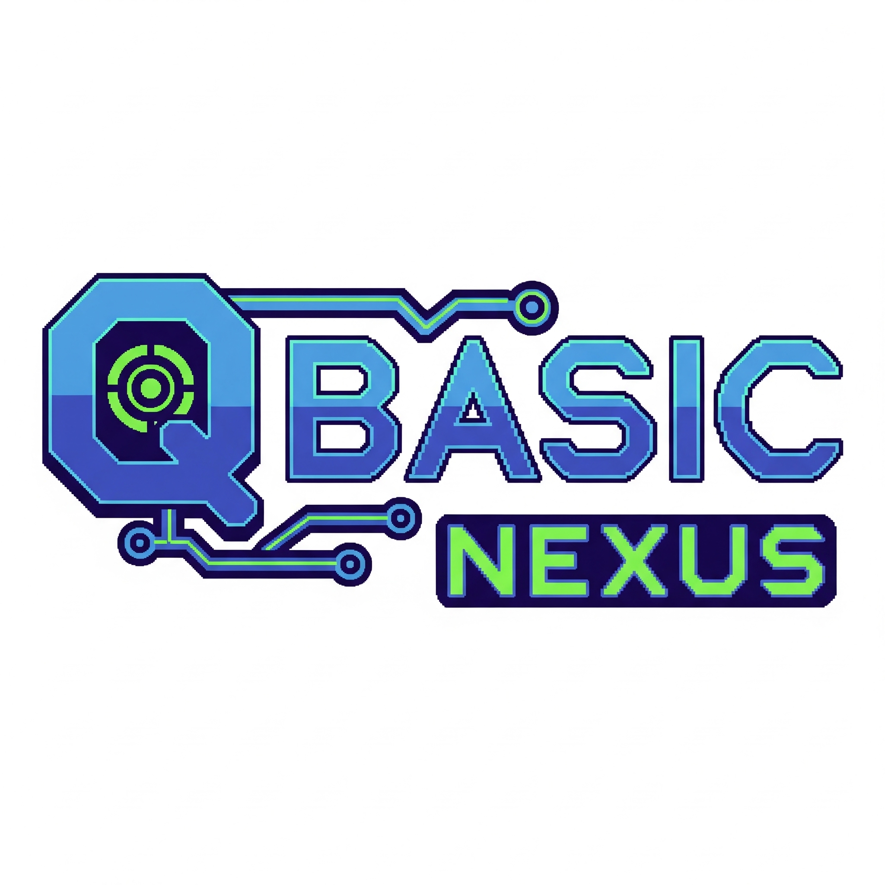

<div align="center">
  
</div>
<div align="center">
  <h1>QBasic Nexus ⚙️</h1>
  <p>
    <strong>The Most Advanced, Lightning-Fast QBasic & QB64 Development Environment Ever Built for VS Code 🚀</strong><br>
    <em>Experience zero-setup compilation, state-of-the-art IntelliSense, and a stunning built-in Retro CRT Web Runtime that leaves all others in the dust.</em>
  </p>
  <p>
    <a href="#-features">Features</a> •
    <a href="#️-prerequisites">Prerequisites</a> •
    <a href="#-getting-started">Getting Started</a> •
    <a href="#-web-runtime-capabilities">Web Runtime</a> •
    <a href="#️-configuration">Configuration</a> •
    <a href="#-troubleshooting">Troubleshooting</a>
  </p>
  <p>
    
    
  </p>
</div>

<br>

**QBasic Nexus** transforms VS Code into an immensely powerful retro-coding station. Engineered from the ground up for raw performance, it features a blazingly fast custom transpiler, multi-tiered caching, and out-of-the-box Windows `.exe` compilation. Whether you're a veteran developer reviving classic code or a newcomer learning the roots of programming, QBasic Nexus provides an unmatched, modern experience for **QBasic** and **QB64**.

---

## 📖 Table of Contents

- [✨ Unrivaled Features](#-unrivaled-features)
  - [⚡ Lightning-Fast Compilation Engine](#-lightning-fast-compilation-engine)
  - [📺 Advanced Web Runtime](#-advanced-web-runtime)
  - [📊 Professional IDE Tools](#-professional-ide-tools)
- [🎮 The Ultimate Interactive Curriculum](#-the-ultimate-interactive-curriculum)
- [⚙️ Prerequisites](#️-prerequisites)
- [🚀 Getting Started](#-getting-started)
- [🎬 Web Runtime Capabilities](#-web-runtime-capabilities)
- [📦 Available Commands](#-available-commands)
- [🛠️ Configuration](#️-configuration)
- [🧩 Snippets Reference](#-snippets-reference)
- [🆘 Troubleshooting](#-troubleshooting)
- [📄 License](#-license)

---

## ✨ Unrivaled Features

### ⚡ Lightning-Fast Compilation Engine

QBasic Nexus doesn't just parse text—it deeply analyzes it using an enterprise-grade compiler pipeline that dramatically outpaces legacy tools.

- **Zero-Setup Native Windows Executables (.exe)**: Instantly compile QBasic code directly to standalone `.exe` files using the internal backend powered by `pkg`. No QB64 installation required for prototyping and distribution!
- **High-Performance Lexer**: Powered by `moo`, achieving over **1,200 KB/s+ throughput** during compilation with zero-copy token passing to eliminate redundant processing.
- **Tiered Cache Architecture**: Includes an L1 Hot Cache and an L2 LRU memory pool powered by lightning-fast FNV-1a hashing. Re-compiling unchanged or slightly modified code is virtually instantaneous (0.03ms cache hits).
- **Dual Pipeline Integration**: Run your code natively via the local **QB64** compiler for heavy-duty system access, or use the **QBasic Nexus Internal** engine for instant logic tests and virtualized sandboxing.

### 📺 Advanced Web Runtime

The internal web runtime is a fully featured emulation layer powered by HTML5 Canvas and the Web Audio API, designed to look and feel exactly like the 90s, but run perfectly today.

- **Retro CRT Aesthetic**: Authentic scanlines, adjustable neon glow effects, and phosphor persistence.
- **Rich Graphics**: Full support for `SCREEN 13`, `PSET`, `LINE`, `CIRCLE`, `PAINT`, `GET`, `PUT`, `DRAW` (Macro language), and seamless color manipulation.
- **High-Fidelity Audio**: Complete `PLAY` command parsing (octaves, tempo, legato/staccato), along with precise `SOUND` frequency generation.
- **Virtual File System**: Fully emulated local file I/O operations (`OPEN`, `WRITE`, `INPUT#`) allowing your QBasic scripts to read/write persistent data right inside the VS Code environment (up to 10MB).
- **Modern Interactions (QB64 Extensions)**: Native support for `_MOUSEINPUT`, `_KEYHIT`, and `INKEY$` for building responsive interactive applications.

### 📊 Professional IDE Tools

Write code faster, with fewer bugs, using tooling typically reserved for modern languages like TypeScript or C#.

- **IntelliSense on Steroids**: Smart auto-completion for over **400+ keywords**, including built-in math functions, string manipulation, and QB64 extensions.
- **Real-Time Diagnostics (Linting)**: Catch syntax errors _as you type_. The parser dynamically evaluates your document with configurable debouncing, highlighting errors without freezing your editor.
- **Instant Code Navigation**: "Go to Definition" (F12) works flawlessly for your custom `SUB`s, `FUNCTION`s, and `TYPE` structures.
- **Symbol Renaming (F2)**: Need to rename a variable used 50 times? Do it instantly across the entire file.
- **At-a-glance Code Stats**: Live status bar counter showing your total Lines of Code, SUBs, and FUNCTIONs.

---

## 🎮 The Ultimate Interactive Curriculum

New to QBasic, or just need to knock off the rust? The **Interactive Tutorial Mode** provides a massive **40-lesson** hands-on curriculum built straight into the editor.

1. Open the Command Palette (`Ctrl+Shift+P` / `Cmd+Shift+P`)
2. Execute **"QBasic: Start Interactive Tutorial 🎮"**
3. Select from 13 comprehensive stages, including:
   - **Basics**: Variables, Input, and Math operators.
   - **Control Flow**: IF...THEN, SELECT CASE, FOR loops, and WHILE routines.
   - **Data Management**: Slicing strings, 2D Arrays, and `DATA`/`READ` blocks.
   - **Advanced Structures**: Custom `TYPE` structs, `SUB`s, and `GLOBAL/SHARED` scopes.
   - **Graphics & Audio**: Draw geometry with `CIRCLE`/`PAINT` and play music with `PLAY`.
4. Read the objective, write the code, and press `F5`—the engine transpiles and verifies your logic instantly!

---

## ⚙️ Prerequisites

### Mode 1: QBasic Nexus Internal (Fully Standalone)

**No prerequisites whatsoever!**
The internal transpiler works out of the box with zero setup. You can write QBasic, compile it into a Node JS runtime `.exe`, or run it in the CRT viewer instantly.

### Mode 2: QB64 Native (For Full Legacy Compatibility)

**Requires QB64 Installation**: Download from [qb64fusion.org](https://qb64fusion.org/) or [qb64phoenix.com](https://www.qb64phoenix.com/)

**Windows**: Download and extract.
**macOS**:

1. Install Xcode Command Line Tools: `xcode-select --install`
2. Run `sh ./setup_osx.command` in the extracted QB64 folder.
   **Linux**:
3. Install build tools: `sudo apt-get install build-essential`
4. Run `sh ./setup_lnx.sh` in the extracted directory.

---

## 🚀 Getting Started

1. **Install QBasic Nexus** from the VS Code Marketplace.
2. **Create a file**: `hello.bas`
3. **Write your absolute banger of a script**:
   ```basic
   SCREEN 13
   COLOR 14
   PRINT "Welcome to the Nexus!"
   CIRCLE (160, 100), 50, 4
   PLAY "T120 O4 L4 C D E F G A B >C"
   ```
4. **Run it**: Press **F5**.
   - Select **"QBasic Nexus"** to compile to a standalone `.exe`.
   - Select **"Run in Retro CRT"** (via Command Palette) to see it rendered beautifully inside VS Code!

---

## 🎬 Web Runtime Capabilities

QBasic Nexus supports over 400 keywords natively for testing within the editor.

| Feature Category | Supported Commands Examples                                                    |
| ---------------- | ------------------------------------------------------------------------------ |
| **Core I/O**     | `PRINT`, `INPUT`, `CLS`, `LOCATE`, `COLOR`, `SCREEN`, `WIDTH`                  |
| **Control Flow** | `IF`, `SELECT CASE`, `FOR...NEXT`, `DO...LOOP`, `WHILE...WEND`, `EXIT`, `GOTO` |
| **Math & Logic** | `ABS`, `INT`, `FIX`, `SIN`, `SQR`, `LOG`, `EXP`, `RND`, `MOD`, `_PI`, `_ROUND` |
| **Strings**      | `LEFT$`, `MID$`, `RIGHT$`, `LEN`, `UCASE$`, `LTRIM$`, `INSTR`, `CHR$`, `ASC`   |
| **File I/O**     | `OPEN`, `CLOSE`, `PRINT#`, `INPUT#`, `EOF`, `FREEFILE` _(Virtual File System)_ |
| **Graphics**     | `LINE`, `CIRCLE`, `PSET`, `DRAW`, `PAINT`, `_RGB32`, `_CLEARCOLOR`             |
| **Input/System** | `INKEY$`, `TIMER`, `SLEEP`, `_LIMIT`, `_MOUSEINPUT`, `_MOUSEX`, `_KEYHIT`      |

---

## 📦 Available Commands

Trigger these via the VS Code Command Palette (`Ctrl+Shift+P`):

| Command                                   | Shortcut       | Description                                                    |
| ----------------------------------------- | -------------- | -------------------------------------------------------------- |
| **QBasic: Compile & Run 🌀**              | `F5`           | Compiles and executes code using your chosen Compiler Mode.    |
| **QBasic: Run in Retro CRT 📺**           | -              | Forces the current file to run in the Webview Visualizer.      |
| **QBasic: Start Interactive Tutorial 🎮** | -              | Opens the 40-lesson interactive training terminal.             |
| **QBasic: Show Code Statistics 📊**       | `Ctrl+Shift+I` | Provides an instant breakdown of line counts, loops, and SUBs. |
| **QBasic: Invalidate Cache**              | -              | Clears the L1/L2 transpiler cache if requested.                |

---

## 🛠️ Configuration

Fine-tune your experience via `File > Preferences > Settings` (Search: `QBasic Nexus`):

| Setting                 | Default        | Description                                                               |
| ----------------------- | -------------- | ------------------------------------------------------------------------- |
| **Compiler Mode**       | `QBasic Nexus` | Choose between the built-in compiler (`QBasic Nexus`) or external `QB64`. |
| **Compiler Path**       | `null`         | Path to `qb64.exe` (only required if using QB64 mode).                    |
| **Compiler Args**       | `""`           | Pass silent flags or memory overrides to QB64 (e.g., `-w`).               |
| **Enable Linting**      | `true`         | Toggles real-time syntax checking and editor underlining.                 |
| **Lint Delay**          | `300`          | MS delay before parsing code after you stop typing (adaptable).           |
| **Auto Format On Save** | `false`        | Standardizes keyword casing and indentation on `Ctrl+S`.                  |

---

## 🧩 Snippets Reference

Never type repetitive code again. Start typing these keywords and press `Tab`:

- **Structures**: `sub`, `function`, `type`, `select`, `if`, `ifelse`
- **Loops**: `for`, `forstep`, `dowhile`, `dountil`, `while`
- **Graphics Components**: `screen`, `line`, `circle`, `rgb`
- **Boilerplates**: `newqb64` (Full empty template), `gameloop` (Pre-built game loop with `_LIMIT` logic)

---

## 🆘 Troubleshooting

### Web Runtime (CRT) Issues

- **No Sound**: Browser security requires interaction. Click anywhere inside the CRT window to enable audio.
- **Simulation Freezing/Excessive CPU**: Always add `_LIMIT 60` or `SLEEP 1` inside infinite `DO...LOOP` routines to yield back to the main thread.
- **Nothing Displays**: Ensure you have initiated `SCREEN 13` at the top of your visual scripts.

### QBasic Nexus (Internal Compiler) Issues

- **Build Errors on Windows**: Ensure there is no active antivirus blocking `pkg` from writing the `.exe` output file.
- **Unknown Variables**: By design, the transpiler gets much happier when variables are explicitly defined (`DIM var AS INTEGER`) before use.

### QB64 Native Mode Issues

- **Compiler not found**: Ensure `qbasic-nexus.compilerPath` points squarely to `qb64.exe` and not just the folder it resides in.
- **Terminal doesn't close on success**: Ensure your QB64 args don't block backgrounding.

---

## 🤝 Contributing

We welcome retro-enthusiasts, optimization junkies, and modern developers!

1. Fork the Repository.
2. Create a Feature Branch (`git checkout -b feature/NeonGlowUpdate`).
3. Commit your changes.
4. Push to the Branch (`git push origin feature/NeonGlowUpdate`).
5. Open a Pull Request!

---

## 📄 License

MIT License © 2026 Thirawat Sinlapasomsak

---

<div align="center">
  <p>Developed with ❤️ by <a href="https://github.com/thirawat27">Thirawat27</a></p>
  <p>
    <a href="https://github.com/thirawat27/QBasic-Nexus">GitHub</a> •
    <a href="https://github.com/thirawat27/QBasic-Nexus/issues">Report Bug</a> •
    <a href="https://github.com/thirawat27/QBasic-Nexus/issues">Request Feature</a>
  </p>
  <p>
    <sub>If QBasic Nexus brought back incredible memories (or helped you learn something new), please consider leaving a ⭐ on GitHub!</sub>
  </p>
</div>
